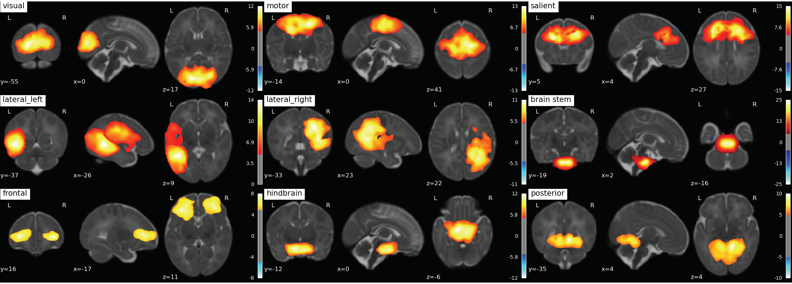
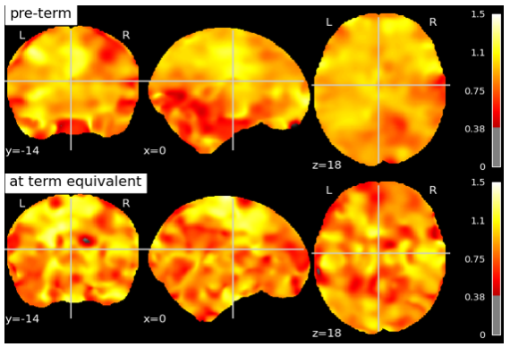
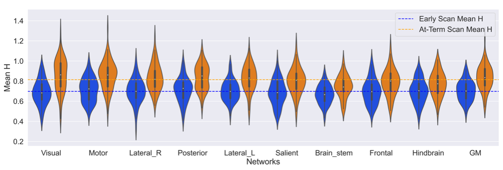

# Fractal-Based Analysis of fMRI BOLD Signal During Naturalistic Viewing Conditions

## Authors: 
**J. Drayne**, BC Children's Hospital Research Institute; **O. Campbell**, BC Children's Hospital Research Institute; C. Chau, BC Children's Hospital Research Institute; S. Miller, SickKids; R. Grunau, BC Children's Hospital Research Institute; **A. M. Weber**, BC Children's Hospital Research Institute

## How to cite: 
Drayne J, Campbell O, Chau C, Miller S, Grunau E, Weber AM. Fractal-Based Analysis of fMRI BOLD Signal During Naturalistic Viewing Conditions. _Proc. Intl. Soc. Mag. Reson. Med._ 30 (2022) **0403**

## Session Info:

Oral Presentation

High-Resolution fMRI & Functional Connectivity

Wednesday, 11 May 2022 | 09:15 - 11:15

**When:** 10:27 - 10:39

Program Number: 0403

## Abstract

### Synopsis

It has been found that fractal analysis of the BOLD signal in fMRI can be used to measure brain functioning, development, and health. There has to our knowledge, however, not been any fractal analysis fMRI studies done in newborns. By computing the mean Hurst exponent in 9 resting state networks and in a grey matter mask. We found the largest increase in the Hurst exponent between pre-term and term equivalent aged subjects was in the motor and visual network. This motivates the need of further exploration of fractal analysis as a measure of brain dynamics in pre-term infants.

### Introduction

It has been found that fractal analysis of the BOLD signal in fMRI can be used to measure brain functioning, development, and health1,2,3 There has to our knowledge, however, not been any fractal analysis fMRI studies done in newborns. Improved capacity to understand brain health in sick pre-term infants is also an important aim of neonatal medicine and is critical to optimize outcomes. Fractal based analysis of resting fMRI could be an easily implemented and a useful measure of brain functioning and development in this cohort. As measured by the Hurst exponent, a surrogate measure of a signals fractality, infants scanned at term-equivalent age (TEA) are expected to have a higher Hurst exponent than infants scanned at pre-term age. A higher Hurst exponent at TEA would represent a more ordered, scale-invariant, and greater long-term memory in the BOLD signal as an infant develops, indicating healthy development.

### Methods

307 scans of 3T fMRI data with TR=3s and ~5 minutes /100 volumes were collected from SickKids Toronto (Steven Miller). Clinical information on their sex, sedation during scan, severity of white matter injury, intraventricular hemorrhage, ventriculomegaly, cerebellar hemorrhage and stroke was provided by SickKids Toronto. After removing scans with 1) a mean frame wise displacement less than 1mm, 2) less than 98 time points, 3) subjects with stroke, and 4) scans that failed during pre-processing due to image distortion we were left with 133 scans (mean birth age 27 ± 2.5 weeks, 64 male and 69 female). Infants were born pre-term and scanned shortly after birth and again at TEA, with scan ages varying from 27 - 48 weeks. The anatomical images (T1w & T2w) were bias corrected4 and the T1w was registered to the T2w5. Anatomical and functional data was then preprocessed using the dHCP pipelines,6,7 and a study specific FIX training file was made8,9,10,11. The data was smoothed12 with a 5mm FWHM kernel and intensity normalised. Each scan was registered to the 40w template from the dHCP pipeline and group ICA13 was performed on both pre-term and TEA scans together producing 9 resting state networks (Fig. 1). The Hurst exponent was calculated using Welch’s method (reference) on the pre-processed data (Fig. 2). The mean H value was calculated in the grey matter masks output from the dHCP anatomical pipeline and in resting state networks (Fig. 3) that were created from group ICA. A Linear Mixed Effects model was used to evaluate how significant the differences of the mean H value in these 10 regions of interest were between early and at TEA scans.

### Results

All regions were found to be statistically different in Hurst exponent values between scan ages (preterm and later term). The largest difference in H between the two ages was found in the Visual ( ΔH = +0.168, p-adj = 9.24e-25, 95%) and Motor network ( ΔH = +0.137, p-adj = 3.24e-15, 95%), whilst the smallest differences was in the Frontal ( ΔH = +0.091, p-adj = 2.08e-8, 95%) and Hindbrain ( ΔH = +0.081, p-adj = 3.99e-6, 95%). The average Hurst exponent values at pre-term age were: 0.70 ± 0.1 in the resting state networks and 0.71 ± 0.1 in the grey matter; and at TEA: 0.81 ± 0.1 in the resting state networks and 0.83 ± 0.1 in the grey matter.

### Figures

|  |
|:--:|
| **Fig. 1: 9 RS-networks identified from Group ICA.** The lateral left network was created by combining two separate networks output from group ICA.  |

|  |
|:--:|
| **Fig 2: Hurst exponent values in a subject scanned at pre-term age and term-equivalent age.** Both scans have been registered to the 40 week old template provided by the dHCP pipeline. |

|  |
|:--:|
| **Fig 3: Mean Hurst exponent value in each Network split by the scan age.** Ordered from largest change in mean Hurst exponent between the scan ages. The dotted lines correspond to the mean Hurst exponent value for each scan age group. The adjusted p values range from 9.24e-25 (Visual) to 3.99e-6 (Hindbrain) in the Resting state networks and 2.32e-13 in the grey matter. |

### Discussion

In this study, we present a clear documented pre-processing pipeline for infants born pre-term using open-source software and available on GitHub at https://github.com/WeberLab/SickKidsFunc Despite significant advances made in neonatal intensive care in the last decades, the timing, progression, and developmental impact of altered brain maturation still remain poorly understood14. We also wanted to provide an implementation of Welch’s method, so that fractal analysis can be more easily used to reveal and quantify inherent brain dynamics.
We found that the largest increase in the Hurst exponent was in the Visual and Motor Networks. Although consensus on the interpretation of the Hurst exponent is still in its infancy, low Hurst exponent values generally represent lower power law scaling, in contrary, a larger Hurst exponent suggests a greater ability for quick thinking as well as slow refinement processes. Hence, a higher Hurst exponent suggests more experience from which the brain can draw upon and we presume the Visual and Motor networks develop the most after birth. With better data, this method may be robust at classifying whether brain functions have been impaired from acquired injuries1,2,3,15,16.

### Acknowledgements

### References

1. O. Dona, M. D. Noseworthy, C. DeMatteo, and J. F. Connolly, “Fractal analysis of brain blood oxygenation level dependent (BOLD) signals from children with mild traumatic brain injury (mTBI),” PLOS ONE, vol. 12, p. e0169647, Jan. 2017
2. V. Maxim, L. S ̧endur, J. Fadili, J. Suckling, R. Gould, R. Howard, and E. Bullmore, “Fractional gaussian noise, functional MRI and alzheimer's disease,” NeuroImage, vol. 25, pp. 141–158, Mar. 2005
3. M. O. Sokunbi, V. B. Gradin, G. D. Waiter, G. G. Cameron, T. S. Ahearn, A. D. Murray, D. J. Steele, and R. T. Staff, “Nonlinear complexity analysis of brain fMRI signals in schizophrenia,” PLoS ONE, vol. 9, p. e95146, May 2014
4. N. J. Tustison, B. B. Avants, P. A. Cook, Y. Zheng, A. Egan, P. A. Yushkevich, and J. C. Gee, “N4itk:improved n3 bias correction,” IEEE Transactions on Medical Imaging, vol. 29, no. 6, pp. 1310–1320, 2010. PMID: 20378467.
5. N. J. Tustison, P. A. Cook, A. Klein, G. Song, S. R. Das, J. T. Duda, B. M. Kandel, N. van Strien, J. R. Stone, J. C. Gee, and B. B. Avants, “Large-scale evaluation of ants and freesurfer cortical thickness measurements,” Neuroimage, vol. 1, no. 99, pp. 166–179, 2014. PMID: 24879923.
6. S. P. Fitzgibbon, S. J. Harrison, M. Jenkinson, L. Baxter, E. C. Robinson, M. Bastiani, J. Bozek, V. Karolis, L. Cordero Grande, A. N. Price, E. Hughes, A. Makropoulos, J. Passerat-Palmbach, A. Schuh, J. Gao, S.-R. Farahibozorg, J. O’Muircheartaigh, J. Ciarrusta, C. O’Keeffe, J. Brandon, T. Arichi, D. Rueckert, J. V. Hajnal, A. D. Edwards, S. M. Smith, E. Duff, and J. Andersson, “The developing human connectome project (dhcp) automated resting-state functional processing framework for newborn infants,” NeuroImage, vol. 223, p. 117303, 2020. PMID: 33795167.
7. A. Makropoulos, E. C. Robinson, A. Schuh, R. Wright, S. Fitzgibbon, J. Bozek, S. J. Counsell, J. Steinweg, K. Vecchiato, J. Passerat-Palmbach, G. Lenz, F. Mortari, T. Tenev, E. P. Duff, M. Bastiani, L. Cordero-Grande, E. Hughes, N. Tusor, J.-D. Tournier, J. Hutter, A. N. Price, R. P. A. G. Teixeira, M. Murgasova, S. Victor, C. Kelly, M. A. Rutherford, S. M. Smith, A. D. Edwards, J. V. Hajnal, M. Jenkinson, and D. Rueckert, “The developing human connectome project: A minimal processing pipeline for neonatal cortical surface reconstruction,” Neuroimage, vol. 173, pp. 88–112, 2018. PMID: 29409960.
8. L. Griffanti, G. Douaud, J. Bijsterbosch, S. Evangelisti, F. Alfaro-Almagro, M. F. Glasser, E. P. Duff, S. Fitzgibbon, R. Westphal, D. Carone, C. F. Beckmann, and S. M. Smith, “Hand classification of fmri ica noise components,” Neuroimage, vol. 1, no. 154, pp. 188–205, 2017. PMID: 27989777.
9. Kelly, R. E., Jr., Alexopoulos, G. S., Wang, Z., Gunning, F. M., Murphy, C. F., Morimoto, S. S., Kanellopoulos, D., Jia, Z., Lim, K. O., & Hoptman, M. J. (2010). Visual inspection of independent components: Defining a procedure for artifact removal from fMRI data. Journal of Neuroscience Methods, 189, 233–245. PMID: 20381530
10. G. Salimi-Khorshidi, G. Douaud, C. F. Beckmann, M. F. Glasser, L. Griffanti, and S. M. Smith, “Automatic denoising of functional mri data: combining independent component analysis and hierarchical fusion of classifiers.,” Neuroimage, vol. 90, pp. 449–468, 2014. PMID: 24389422
11. L. Griffanti, G. Salimi-Khorshidi, C. F. Beckmann, E. J. Auerbach, G. Douaud, C. E. Sexton, E. Zsoldos, K. P. Ebmeier, N. Filippini, C. E. Mackay, S. Moeller, J. Xu, E. Yacoub, G. Baselli, K. Ugurbil, K. L. Miller, and S. M. Smith, “Ica-based artefact removal and accelerated fmri acquisition for improved resting state network imaging,” Neuroimage, vol. 95, pp. 232–247, 2014. PMID: 24657355
12. S. M. Smith and J. M. Brady, “Susan—a new approach to low level image processing,” International Journal of Computer Vision volume, vol. 23, pp. 45–78, 1997
13. C. F. Beckmann and S. M. Smith, “Probabilistic independent component analysis for functional magnetic resonance imaging,” IEEE Transactions on Medical Imaging, vol. 2, pp. 137–152, 2004. PMID: 14964560
14. M. Bouyssi-Kobar, A. J. du Plessis, R. McCarter, M. Brossard-Racine, J. Murnick, L. Tinkleman, R. L. Robertson, and C. Limperopoulos, “Third trimester brain growth in preterm infants compared with in utero healthy fetuses,” Pediatrics, vol. 138, p. e20161640, Oct. 2016
15. O. Dona, G. B. Hall, and M. D. Noseworthy, “Temporal fractal analysis of the rs-BOLD signal identifies brain abnormalities in autism spectrum disorder,” PLOS ONE, vol. 12, p. e0190081, Dec. 2017.
16. M.-C. Lai, M. V. Lombardo, B. Chakrabarti, S. A. Sadek, G. Pasco, S. J. Wheelwright, E. T. Bullmore, S. Baron-Cohen, and J. S

