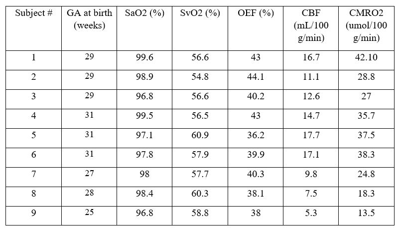
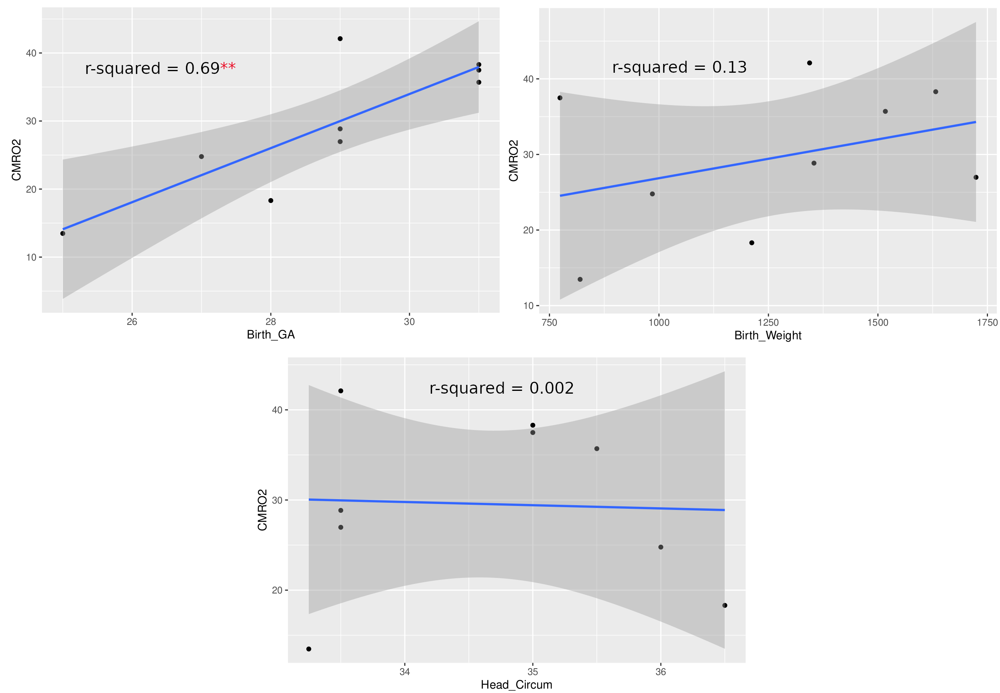
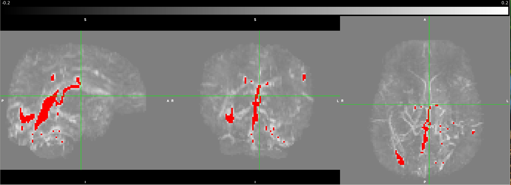
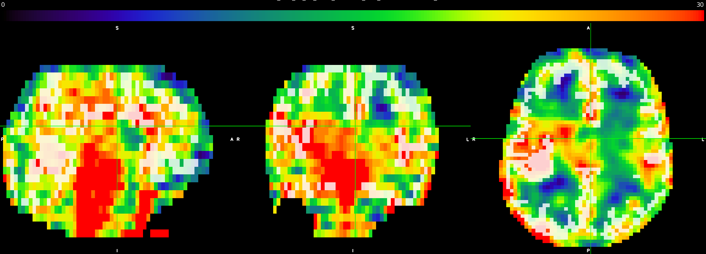
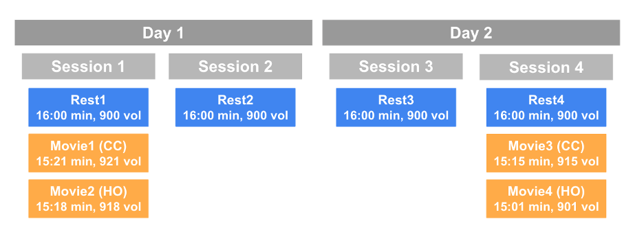
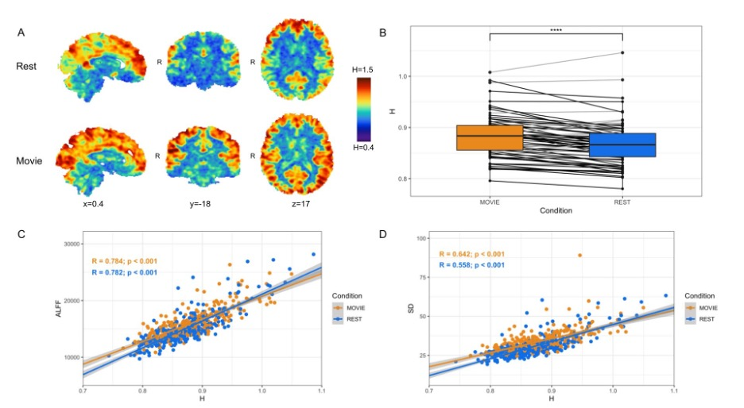
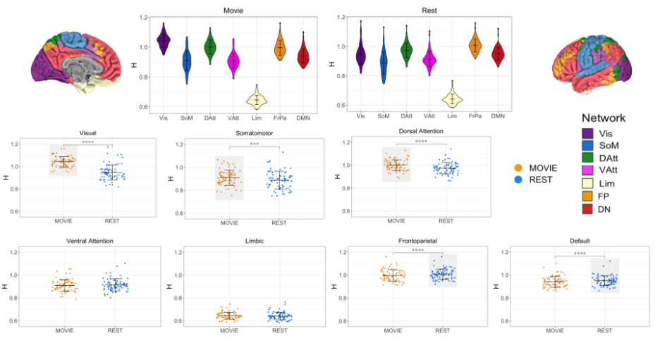
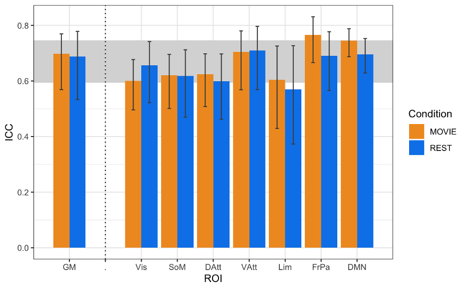
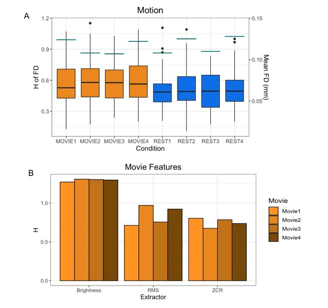

# **ISMRM 2022**
# Table of Contents
1. [Fractal Analysis of the BOLD Signal in Preterm Infants Scanned Shortly After Birth and at Term-Equivalent Age](#johann)
2. [Brain Health in Preterm Infants: Cerebral Metabolic Rate of Oxygen (CMRO2) Using Advanced MRI](#anna)
3. [Fractal-Based Analysis of fMRI BOLD Signal During Naturalistic Viewing Conditions](#olivia)

## Fractal Analysis of the BOLD Signal in Preterm Infants Scanned Shortly After Birth and at Term-Equivalent Age 

**J. Drayne**, BC Children's Hospital Research Institute; **O. Campbell**, BC Children's Hospital Research Institute; C. Chau, BC Children's Hospital Research Institute; S. Miller, SickKids; R. Grunau, BC Children's Hospital Research Institute; **A. M. Weber**, BC Children's Hospital Research Institute

### CITATION:
 
Drayne J, Campbell O, Chau C, Miller S, Grunau E, Weber AM. Fractal Analysis of the BOLD Signal in Preterm Infants Scanned Shortly After Birth and at Term-Equivalent Age. _Proc. Intl. Soc. Mag. Reson. Med._ **30** (2022) 0403

### Session Info:

Oral Presentation

High-Resolution fMRI & Functional Connectivity

Wednesday, 11 May 2022 | 09:15 - 11:15

When: 10:27 - 10:39

Program Number: 0403

### Synopsis

It has been found that fractal analysis of the BOLD signal in fMRI can be used to measure brain functioning, development, and health. There has to our knowledge, however, not been any fractal analysis fMRI studies done in newborns. By computing the mean Hurst exponent in 9 resting state networks and in a grey matter mask. We found the largest increase in the Hurst exponent between pre-term and term equivalent aged subjects was in the motor and visual network. This motivates the need of further exploration of fractal analysis as a measure of brain dynamics in pre-term infants.

### Introduction

It has been found that fractal analysis of the BOLD signal in fMRI can be used to measure brain functioning, development, and health1,2,3 There has to our knowledge, however, not been any fractal analysis fMRI studies done in newborns. Improved capacity to understand brain health in sick pre-term infants is also an important aim of neonatal medicine and is critical to optimize outcomes. Fractal based analysis of resting fMRI could be an easily implemented and a useful measure of brain functioning and development in this cohort. As measured by the Hurst exponent, a surrogate measure of a signals fractality, infants scanned at term-equivalent age (TEA) are expected to have a higher Hurst exponent than infants scanned at pre-term age. A higher Hurst exponent at TEA would represent a more ordered, scale-invariant, and greater long-term memory in the BOLD signal as an infant develops, indicating healthy development.

### Methods

307 scans of 3T fMRI data with TR=3s and ~5 minutes /100 volumes were collected from SickKids Toronto (Steven Miller). Clinical information on their sex, sedation during scan, severity of white matter injury, intraventricular hemorrhage, ventriculomegaly, cerebellar hemorrhage and stroke was provided by SickKids Toronto. After removing scans with 1) a mean frame wise displacement less than 1mm, 2) less than 98 time points, 3) subjects with stroke, and 4) scans that failed during pre-processing due to image distortion we were left with 133 scans (mean birth age 27 ± 2.5 weeks, 64 male and 69 female). Infants were born pre-term and scanned shortly after birth and again at TEA, with scan ages varying from 27 - 48 weeks. The anatomical images (T1w & T2w) were bias corrected4 and the T1w was registered to the T2w5. Anatomical and functional data was then preprocessed using the dHCP pipelines,6,7 and a study specific FIX training file was made8,9,10,11. The data was smoothed12 with a 5mm FWHM kernel and intensity normalised. Each scan was registered to the 40w template from the dHCP pipeline and group ICA13 was performed on both pre-term and TEA scans together producing 9 resting state networks (Fig. 1). The Hurst exponent was calculated using Welch’s method (reference) on the pre-processed data (Fig. 2). The mean H value was calculated in the grey matter masks output from the dHCP anatomical pipeline and in resting state networks (Fig. 3) that were created from group ICA. A Linear Mixed Effects model was used to evaluate how significant the differences of the mean H value in these 10 regions of interest were between early and at TEA scans.

### Results

All regions were found to be statistically different in Hurst exponent values between scan ages (preterm and later term). The largest difference in H between the two ages was found in the Visual ( ΔH = +0.168, p-adj = 9.24e-25, 95%) and Motor network ( ΔH = +0.137, p-adj = 3.24e-15, 95%), whilst the smallest differences was in the Frontal ( ΔH = +0.091, p-adj = 2.08e-8, 95%) and Hindbrain ( ΔH = +0.081, p-adj = 3.99e-6, 95%). The average Hurst exponent values at pre-term age were: 0.70 ± 0.1 in the resting state networks and 0.71 ± 0.1 in the grey matter; and at TEA: 0.81 ± 0.1 in the resting state networks and 0.83 ± 0.1 in the grey matter.

### Figures

|  |
|:--:|
| **Fig. 1: 9 RS-networks identified from Group ICA.** The lateral left network was created by combining two separate networks output from group ICA.  |

|  |
|:--:|
| **Fig 2: Hurst exponent values in a subject scanned at pre-term age and term-equivalent age.** Both scans have been registered to the 40 week old template provided by the dHCP pipeline. |

|  |
|:--:|
| **Fig 3: Mean Hurst exponent value in each Network split by the scan age.** Ordered from largest change in mean Hurst exponent between the scan ages. The dotted lines correspond to the mean Hurst exponent value for each scan age group. The adjusted p values range from 9.24e-25 (Visual) to 3.99e-6 (Hindbrain) in the Resting state networks and 2.32e-13 in the grey matter. |

### Discussion

In this study, we present a clear documented pre-processing pipeline for infants born pre-term using open-source software and available on GitHub at https://github.com/WeberLab/SickKidsFunc Despite significant advances made in neonatal intensive care in the last decades, the timing, progression, and developmental impact of altered brain maturation still remain poorly understood14. We also wanted to provide an implementation of Welch’s method, so that fractal analysis can be more easily used to reveal and quantify inherent brain dynamics.
We found that the largest increase in the Hurst exponent was in the Visual and Motor Networks. Although consensus on the interpretation of the Hurst exponent is still in its infancy, low Hurst exponent values generally represent lower power law scaling, in contrary, a larger Hurst exponent suggests a greater ability for quick thinking as well as slow refinement processes. Hence, a higher Hurst exponent suggests more experience from which the brain can draw upon and we presume the Visual and Motor networks develop the most after birth. With better data, this method may be robust at classifying whether brain functions have been impaired from acquired injuries1,2,3,15,16.

### Acknowledgements

### References

1. O. Dona, M. D. Noseworthy, C. DeMatteo, and J. F. Connolly, “Fractal analysis of brain blood oxygenation level dependent (BOLD) signals from children with mild traumatic brain injury (mTBI),” PLOS ONE, vol. 12, p. e0169647, Jan. 2017
2. V. Maxim, L. S ̧endur, J. Fadili, J. Suckling, R. Gould, R. Howard, and E. Bullmore, “Fractional gaussian noise, functional MRI and alzheimer's disease,” NeuroImage, vol. 25, pp. 141–158, Mar. 2005
3. M. O. Sokunbi, V. B. Gradin, G. D. Waiter, G. G. Cameron, T. S. Ahearn, A. D. Murray, D. J. Steele, and R. T. Staff, “Nonlinear complexity analysis of brain fMRI signals in schizophrenia,” PLoS ONE, vol. 9, p. e95146, May 2014
4. N. J. Tustison, B. B. Avants, P. A. Cook, Y. Zheng, A. Egan, P. A. Yushkevich, and J. C. Gee, “N4itk:improved n3 bias correction,” IEEE Transactions on Medical Imaging, vol. 29, no. 6, pp. 1310–1320, 2010. PMID: 20378467.
5. N. J. Tustison, P. A. Cook, A. Klein, G. Song, S. R. Das, J. T. Duda, B. M. Kandel, N. van Strien, J. R. Stone, J. C. Gee, and B. B. Avants, “Large-scale evaluation of ants and freesurfer cortical thickness measurements,” Neuroimage, vol. 1, no. 99, pp. 166–179, 2014. PMID: 24879923.
6. S. P. Fitzgibbon, S. J. Harrison, M. Jenkinson, L. Baxter, E. C. Robinson, M. Bastiani, J. Bozek, V. Karolis, L. Cordero Grande, A. N. Price, E. Hughes, A. Makropoulos, J. Passerat-Palmbach, A. Schuh, J. Gao, S.-R. Farahibozorg, J. O’Muircheartaigh, J. Ciarrusta, C. O’Keeffe, J. Brandon, T. Arichi, D. Rueckert, J. V. Hajnal, A. D. Edwards, S. M. Smith, E. Duff, and J. Andersson, “The developing human connectome project (dhcp) automated resting-state functional processing framework for newborn infants,” NeuroImage, vol. 223, p. 117303, 2020. PMID: 33795167.
7. A. Makropoulos, E. C. Robinson, A. Schuh, R. Wright, S. Fitzgibbon, J. Bozek, S. J. Counsell, J. Steinweg, K. Vecchiato, J. Passerat-Palmbach, G. Lenz, F. Mortari, T. Tenev, E. P. Duff, M. Bastiani, L. Cordero-Grande, E. Hughes, N. Tusor, J.-D. Tournier, J. Hutter, A. N. Price, R. P. A. G. Teixeira, M. Murgasova, S. Victor, C. Kelly, M. A. Rutherford, S. M. Smith, A. D. Edwards, J. V. Hajnal, M. Jenkinson, and D. Rueckert, “The developing human connectome project: A minimal processing pipeline for neonatal cortical surface reconstruction,” Neuroimage, vol. 173, pp. 88–112, 2018. PMID: 29409960.
8. L. Griffanti, G. Douaud, J. Bijsterbosch, S. Evangelisti, F. Alfaro-Almagro, M. F. Glasser, E. P. Duff, S. Fitzgibbon, R. Westphal, D. Carone, C. F. Beckmann, and S. M. Smith, “Hand classification of fmri ica noise components,” Neuroimage, vol. 1, no. 154, pp. 188–205, 2017. PMID: 27989777.
9. Kelly, R. E., Jr., Alexopoulos, G. S., Wang, Z., Gunning, F. M., Murphy, C. F., Morimoto, S. S., Kanellopoulos, D., Jia, Z., Lim, K. O., & Hoptman, M. J. (2010). Visual inspection of independent components: Defining a procedure for artifact removal from fMRI data. Journal of Neuroscience Methods, 189, 233–245. PMID: 20381530
10. G. Salimi-Khorshidi, G. Douaud, C. F. Beckmann, M. F. Glasser, L. Griffanti, and S. M. Smith, “Automatic denoising of functional mri data: combining independent component analysis and hierarchical fusion of classifiers.,” Neuroimage, vol. 90, pp. 449–468, 2014. PMID: 24389422
11. L. Griffanti, G. Salimi-Khorshidi, C. F. Beckmann, E. J. Auerbach, G. Douaud, C. E. Sexton, E. Zsoldos, K. P. Ebmeier, N. Filippini, C. E. Mackay, S. Moeller, J. Xu, E. Yacoub, G. Baselli, K. Ugurbil, K. L. Miller, and S. M. Smith, “Ica-based artefact removal and accelerated fmri acquisition for improved resting state network imaging,” Neuroimage, vol. 95, pp. 232–247, 2014. PMID: 24657355
12. S. M. Smith and J. M. Brady, “Susan—a new approach to low level image processing,” International Journal of Computer Vision volume, vol. 23, pp. 45–78, 1997
13. C. F. Beckmann and S. M. Smith, “Probabilistic independent component analysis for functional magnetic resonance imaging,” IEEE Transactions on Medical Imaging, vol. 2, pp. 137–152, 2004. PMID: 14964560
14. M. Bouyssi-Kobar, A. J. du Plessis, R. McCarter, M. Brossard-Racine, J. Murnick, L. Tinkleman, R. L. Robertson, and C. Limperopoulos, “Third trimester brain growth in preterm infants compared with in utero healthy fetuses,” Pediatrics, vol. 138, p. e20161640, Oct. 2016
15. O. Dona, G. B. Hall, and M. D. Noseworthy, “Temporal fractal analysis of the rs-BOLD signal identifies brain abnormalities in autism spectrum disorder,” PLOS ONE, vol. 12, p. e0190081, Dec. 2017.
16. M.-C. Lai, M. V. Lombardo, B. Chakrabarti, S. A. Sadek, G. Pasco, S. J. Wheelwright, E. T. Bullmore, S. Baron-Cohen, and J. S

## Brain Health in Preterm Infants: Cerebral Metabolic Rate of Oxygen (CMRO2) Using Advanced MRI 

**C. S. Zhu**, BC Children’s Hospital; **A. Weber**, BC Children’s Hospital; R. Grunau, BC Children’s Hospital; N. Chan, BC Children’s Hospital

### CITATION:

Zhu CS, Weber AM, Grunau R, Chan N. Brain Health in Preterm Infants: Cerebral Metabolic Rate of Oxygen (CMRO2) Using Advanced MRI. Proc. Intl. Soc. Mag. Reson. Med. **30** (2022) 2368

### Session Info:

Digital Poster\
Susceptibility; Contrast Mechanisms; Module 16: Diffusion\
Wednesday, 11 May 2022 | 16:45 - 17:45\
Program Number: 2368\
Computer Number: 104

### Synopsis

Cerebral metabolic rate of oxygen (CMRO2) is a measurement of oxygen metabolism that may help determine outcomes in preterm neonates and improve treatments. However, limitations exist in current methods for measuring CMRO2. Advanced MRI techniques such as quantitative susceptibility mapping (QSM) may be able to overcome these challenges. GE 3T MRI data of preterm neonates at term equivalent age (TEA) (n=9) was obtained and analyzed using a standard equation to determine the CMRO2. CMRO2 values agreed with literature values and correlated strongly with birth age, but not with birth weight or head circumference at birth.

### Introduction

Approximately every 1 in 10 babies are born preterm1. About 50% display cognitive, motor, and behavioural problems long-term2. Improving the capacity to understand neonatal brain health is a major focus of neonatal medicine and can aid the development of optimized treatments. Oxygen metabolism in the brain is an important indicator of neonatal brain health; however, it has historically been difficult to measure in neonates. Most clinical measurements of oxygen metabolism only determine the level of oxygen delivery, for example, cerebral venous oxygen saturation (CSvO2), and not full oxygen metabolism such as cerebral metabolic rate of oxygen (CMRO2). Measurements of CMRO2 can provide information with greater clinical relevance including the balance of neonatal cerebral oxygen delivery and demand. Most studies measuring neonatal CMRO2 often use methods that have limitations or certain levels of invasiveness. Positron Emission Tomography (PET) is the gold standard for measuring CMRO2, however, there is concern that it may be unsafe in neonates due to the radiation used. Near infrared spectroscopy (NIRS) is alternative method which is safe but encounters limitations due to difficulties in determining the depth of light penetration3. Recent advances in magnetic resonance imaging (MRI) such as quantitative susceptibility mapping (QSM) in combination with arterial spin labeling (ASL) may be a safe, precise, and non-invasive method of quantifying CMRO2. It is hypothesized that CMRO2 values measured using advanced MRI techniques in preterm neonates at term equivalent age (TEA) will be between 20-45umol/100g/min and in agreement with literature values obtained from studies using PET4, NIRS5,6, or alternative MRI scans7-10. CMRO2 is also expected to be related to clinical indices health, such as birth age and head circumference. 

### Methods

To assess the feasibility of measuring CMRO2 in neonates using advanced MRI techniques, approximately 9 preterm neonates born <32 weeks gestation receiving standard clinical care in the NICU are being recruited at the Children's and Women's Health Centre of BC. 3D-T1w, 3DT2w, ASL and SWI/QSM sequences were obtained. MRI data was analyzed using a combination of FSL. ANTS, and in house Matlab and Python software and organized as per the Brain Imaging Data Structure (BIDS). T1w and T2w data was processed through the dHCP structural pipeline in order to obtain brain masks and grey matter segmentation. Cerebral blood flow (CBF) of grey matter is derived from ASL as shown in Equation (1)11:\

\

The QSM data is post-processed using an algorithm from https://github.com/kamesy/QSM.m to produce a magnetic susceptibility map12. CSvO2 was derived from Equation (2)13:\

\

Where χblood was taken to be the average of all χ above 0.15 ppm14. The oxygen extraction fraction (OEF) was calculated from the arterial oxygen saturation (SaO2) derived from pulse oximeter measurements and the CSvO2. Using the OEF, the CBF, and the hemoglobin concentration, CMRO2 is calculated using Equation (3)15:\

\

The relationship between CMRO2 and clinical measures of health will be evaluated through a partial correlation analysis using statistical software R.

### Results

Currently, CMRO2 values from 9 subjects have been obtained. Of the subjects, 6 were female. These values are illustrated in Table 1. Mean head circumference at birth was 34.64 cm; mean birth weight was 1262 g; the mean GA at birth was 28.89 weeks; and the mean age at scan was 39.4 weeks. CMRO2 values were also compared to GA at birth, birth weight, and head circumference at birth using a pearson correlation (Fig 1.) The correlation between GA at birth and CMRO2 was statistically significant (p = 0.0053, r2 = 0.69); whereas the other correlations we looked at were not (birth weight: p = 0.335, r2 = 0.133; head circumference: p = 0.908, r2 = 0.002)

### Figures

|  |
|:--:|
| **Table 1:** Table 1. Summary of PMA, SaO2, SvO2, OEF, CBF, and CMRO2 values for 9 subjects |

|  |
|:--:|
| **Fig 1:** Pearson correlation of CMRO2 with GA at birth, birth weight, and head circumference at birth |

|  |
|:--:|
| **Fig 2:** Processed QSM scan as underlay with a vessel mask projected in red at maximum intensity by thresholding the QSM image at 0.15ppm. The views from left to right are sagittal, coronal, and axial. |

|  |
|:--:|
| **Fig 3:** Processed ASL scan as underlay in color, from 0 to 30 mL/100 g/min, with a grey matter mask as overlay in slightly transparent white. The views from left to right are sagittal, coronal, and axial. |

### Discussion

These results represent a proof-of-concept of an ongoing pilot study of ours. We are just under halfway in terms of recruitment and data processing. We hope to use this pilot study to secure funding for a larger study, with follow-up. Literature standards of CMRO2 values in preterm neonates at TEA range from 20-45umol/100g/min. Values obtained from advanced MRI methods are within this range and thus agree with the literature. Two subjects had CMRO2 values lower than 20umol/100g/min; however, these subjects were also amongst the youngest, and we believe these values are accurate. As seen in Figure 1, CMRO2 correlated strongly with GA at birth (r2 = 0.69), but not birth weight or head circumference at birth. We hope to investigate the correlation of CMRO2 with other metrics in the future when we have access to more clinical data, such as time on respirator. The fact that CMRO2 correlates strongly with birth age suggests that babies born earlier have significantly lower cerebral oxygen metabolism values, even at equivalent term age. Finally, we are currently looking at whole-brain CMRO2. One benefit to CMRO2 obtained with MRI is a more region-based analysis of oxygen metabolism could be performed in the future to investigate regional brain health.

### Conclusion

This study provides preliminary proof-of-concept data to establish the feasibility of a non-invasive and precise advanced MRI technique in determining neonatal brain health and oxygen metabolism. This may be clinically relevant in further aiding and optimizing the development of therapies for brain injured neonates.

### Acknowledgements

We would like to thank the BC Children's Hospital Research Institute and the BC Children's Hospital BB&D Catalyst Grant for funding.

### References:

1. Purisch SE, Gyamfi-Bannerman C. Epidemiology of preterm birth. Seminars in Perinatology. 2017;41(7):387-391.
2. Spittle AJ, Barton S, Treyvaud K, Molloy CS, Doyle LW, Anderson PJ. School-age outcomes of early intervention for preterm infants and their parents: a randomized trial. PEDIATRICS. 2016;138(6):e20161363-e20161363.
3. Liu P, Chalak LF, Lu H. Non-invasive assessment of neonatal brain oxygen metabolism: A review of newly available techniques. Early Human Development. 2014;90(10):695-701.
4. Altman DI, Perlman JM, Volpe JJ, Powers WJ. Cerebral oxygen metabolism in newborns. Pediatrics. 1993;92(1):99-104.
5. Elwell CE, Henty JR, Leung TS, et al. Measurement of cmro2 in neonates undergoing intensive care using near infrared spectroscopy. In: Okunieff P, Williams J, Chen Y, eds. Oxygen Transport to Tissue XXVI. Advances in Experimental Medicine and Biology. Springer US; 2005:263-268.
6. Skov L, Pryds O, Greisen G, Lou H. Estimation of cerebral venous saturation in newborn infants by near infrared spectroscopy. Pediatr Res. 1993;33(1):52-55.
7. De Vis JB, Petersen ET, Alderliesten T, et al. Non-invasive MRI measurements of venous oxygenation, oxygen extraction fraction and oxygen consumption in neonates. NeuroImage. 2014;95:185-192.
8. Jain V, Buckley EM, Licht DJ, et al. Cerebral oxygen metabolism in neonates with congenital heart disease quantified by mri and optics. J Cereb Blood Flow Metab. 2014;34(3):380-388.
9. Liu P, Huang H, Rollins N, et al. Quantitative assessment of global cerebral metabolic rate of oxygen (CMRO 2 ) in neonates using MRI: NONINVASIVE MEASUREMENT OF CMRO 2 IN NEONATES BY MRI. NMR Biomed. 2014;27(3):332-340.
10. Shetty AN, Lucke AM, Liu P, et al. Cerebral oxygen metabolism during and after therapeutic hypothermia in neonatal hypoxic–ischemic encephalopathy: a feasibility study using magnetic resonance imaging. Pediatr Radiol. 2019;49(2):224-233.\
11. Massaro AN, Bouyssi-Kobar M, Chang T, Vezina LG, du Plessis AJ, Limperopoulos C. Brain perfusion in encephalopathic newborns after therapeutic hypothermia. AJNR Am J Neuroradiol. 2013;34(8):1649-1655.
12. Kames C, Wiggermann V, Rauscher A. Rapid two-step dipole inversion for susceptibility mapping with sparsity priors. NeuroImage. 2018;167:276-283.
13. Berg RC, Preibisch C, Thomas DL, Shmueli K, Biondetti E. Investigating the Effect of Flow Compensation and Quantitative Susceptibility Mapping Method on the Accuracy of Venous Susceptibility Measurement. Neuroscience; 2021.
14. Weber AM, Zhang Y, Kames C, Rauscher A. Quantitative susceptibility mapping of venous vessels in neonates with perinatal asphyxia. AJNR Am J Neuroradiol. 2021;42(7):1327-1333.
15. Chong SP, Merkle CW, Leahy C, Srinivasan VJ. Cerebral metabolic rate of oxygen (Cmro_2) assessed by combined Doppler and spectroscopic OCT. Biomed Opt Express. 2015;6(10):3941.

## Fractal-Based Analysis of fMRI BOLD Signal During Naturalistic Viewing Conditions 

**O. Campbell**, University of British Columbia; T. Vanderwal, University of British Columbia; **A. Weber**, University of British Columbia.

### UPDATE:

[This study has been published in _Frontiers Physiology_](https://www.frontiersin.org/articles/10.3389/fphys.2021.809943/full) since we submitted the abstract to ISMRM in Fall 2021. 

### Session Info:

Digital Poster\
Processing & Analysis: Data Processing I; Acquisition & Analysis; Module 22: Processing & Analysis\
Thursday, 12 May 2022 | 17:00 - 18:00\
Program Number: 2847\
Computer Number: 31

### Synopsis

We investigated the difference between the brain’s fractal dynamics during movie-watching and resting-state conditions using 7T fMRI data. During movie-watching, we find that the BOLD signal becomes more scale-invariant and self-similar than during the resting-state. This supports the idea that movie-watching evokes a state of optimal neural functioning that may better reflect the endogenous state of the brain than a fixed cross-hair. We also find that fractal properties differ greatly across functional networks, providing novel information about the temporal dynamics of each network during naturalistic processing. Overall, these findings advance understanding of both fractal dynamics and naturalistic viewing in fMRI.

### Introduction
Fractal processes are characterized by prominent scale-invariance and self-similarity across a hierarchy of time-scales1. Fractal analysis of functional magnetic resonance imaging (fMRI) data quantifies this scaling behaviour in a single parameter, the Hurst exponent (H). H is a measure of the strength of correlation in a signal, where higher values reflect a more correlated and temporally redundant structure in the blood-oxygen level dependent (BOLD) signal2. Multiple fMRI studies have observed that H is lower during conventional tasks relative to resting-state conditions, suggesting a shift to less correlated, more random signal processes during task completion3,4,5. However, to date no study has assessed BOLD signal fractal dynamics during more ecologically-valid and naturalistic tasks, such as movie-watching. Previous findings indicate that movie-watching alters the temporal characteristics of BOLD signal in unique ways6,7, but few papers have attempted to directly quantify these changes in signal characteristics. Therefore, we wanted to determine if the BOLD signal had different fractal dynamics during the processing of a continuous and naturalistic stimuli (movie) compared to a stationary cross-hair (rest). Furthermore, we aimed to investigate whether any differences were network specific, the test-retest reliability of H, and if BOLD signal fractal dynamics may originate from internal sources (i.e. motion) or external sources (i.e. movie features).

### Methods
The data are from the Human Connectome Project (HCPS1200 release)8. Resting-state and movie-watching fMRI data was collected on a 7T Siemen’s Magnetom scanner with TR=1s, TE=22.2 ms, flip angle=45°, FOV=208 x 208 mm2, voxel size=1.3x1.3x1.3 mm3. There are four runs per condition with a scan duration of ~15 minutes resulting in ~900 time-points each (Figure 1). The pre-processed ICA-FIX denoised data from HCP was used and a 5mm FWHM smoothing was applied. 72 subjects were included in the sample (41 F; 29.46 +/- 3.76 years of age) with a mean framewise displacement (FD) of >0.15mm. H was calculated using Welch’s method9 in the grey matter and 7 networks: visual (Vis), somatomotor (SoM), dorsal attention (DAtt), ventral attention (VAtt), limbic (Lim), frontoparietal (FP), and default network (DN)10. H was compared between conditions using a paired Student’s T-test and multiple comparisons were corrected for using Holm’s Step-Down Procedure. The intraclass correlation coefficient (ICC) was calculated for Movie and Rest using the ICC(2,1) model to measure reliability. H was also calculated for every subject’s FD time-series and the time-series of three movie features to analyze the fractal properties of head movement and the movie stimuli.

### Results
In contrast to previous work using conventional task paradigms, we found higher H values during movie-watching than rest in the grey matter (mean difference = 0.014; p = 5.279x10-7; 95% CI [0.009, 0.019]) (Figure 2). At the network level, H was significantly higher in the Vis, SoM and DAtt networks during movie-watching. Conversely, H was significantly lower during movie-watching in the FP and default networks (Figure 3). The ICC values indicate the test-retest reliability of H is good overall and there is no difference in movie-watching (0.698 (95% CI [0.569, 0.770]) and rest (0.688 (95% CI [0.533, 0.779]) conditions (Figure 4). We further found that H values of head motion estimates were non-fractal, whereas H values of movie-derived stimulus properties (e.g., luminance changes) were fractal (Figure 5).

### Figures

|  |
|:--:|
| **Fig 1:** A schematic of the HCP scanning protocol by day and session. Blue boxes indicate resting-state runs and orange boxes represent movie-watching runs. CC: Creative commons; HO: Hollywood excerpts. |

|  |
|:--:|
| **Fig 2:** Cross-condition comparison of whole-brain H (N=72). A) H values in rest (top) and movie-watching (bottom) of sample sagittal, coronal and axial slices in one subject. B) Box-plot of H between Movie Watching (orange) and Rest (blue) showing group-level finding that H-values are greater in Movie. C,D) Scatter-plot of H vs. ALFF and H vs. standard deviation of BOLD values, respectively, with Movie (orange) and Rest (blue), showing positive correlations for both conditions in both cases. |

|  |
|:--:|
| **Fig 3:** H across conditions, by network (N=72). Top centre: violin plots for Movie and Rest showing H values of seven RSNs from Yeo et al. Brains at the top left and right show topography of those networks using the same colours. Bottom: box-plot of H by condition for each RSN separately. Light grey boxes highlight which condition had the higher statistically significant average value. |

|  |
|:--:|
| **Fig 4:** ICCs of H across resting state runs and different movies. GM shown on left, with the seven RSNs on the right (separated by vertical dashed line). Vertical black bars represent 95% confidence intervals. Horizontal grey band in background represents good test-retest reliability (0.60<ICC<0.74). |

|  |
|:--:|
| **Fig 5:** H values of other possible sources of fractality. A) H values of the FD time-series of all 72 subjects by run are shown in the boxplots. Orange boxplots are the Movie runs, blue are the Rest runs. The mean FD values are shown by the horizontal teal lines for each run using the secondary y-axis (right). B) H values of the time-series of three movie features (brightness, RMS, ZCR) for each movie. |

### Discussion

In the grey matter, we found that H values were higher during movie-watching than the resting state. This means that during movie-watching there is stronger long-range dependence in the signal such that past dynamics more heavily mediate future brain processes. We speculate that as the brain configures and reconfigures to process the continually changing movie stimulus11, fractal dynamics are used to efficiently transition the brain through a rich sequence of brain states. This naturalistic task finding contrasts previous task-based reports of H, which found that it decreases from rest during a task3,4,5. We speculate this is because fractal dynamics involved in signal processing may depend largely on the nature of the stimulus, where continuous stimuli may evoke a more temporally redundant, hierarchical signal structure than a stationary crosshair. Furthermore, we find that changes in H differ greatly across networks; H is significantly higher during movie-watching in three networks and significantly lower in two. This suggests that individual networks exhibit distinct temporal dynamics that depend on the demands of the current task. From our investigation into fractal origins, we conclude that the fractal behaviour in the BOLD signal is unlikely due to intrinsic head motion. Moreover, we find that the movie features also have fractal properties, suggesting that the BOLD signal may be more fractal during movie-watching because the brain is processing a fractal stimulus. This supports the theory that movies evoke ecologically-valid dynamics since scale-invariant processes have more similar statistical properties to the real world11. Overall, our findings suggest that movie-watching induces signal dynamics that more closely resemble the brain’s endogenous fractal state.

### Conclusion

These findings provide new and quantitative information about BOLD signal characteristics during movie-watching conditions compared to the conventional resting-state. They reveal possible signal mechanisms involved in endogenous perception and lay a foundation for future investigations into the origin and function of scale-free dynamics in natural neural processing.

### Acknowledgements

We thank Jeffrey Eilbott for expert consultation with data management and analytics, and Michael Breakspear for helpful conceptual comments. The authors of this study were financially supported by the British Columbia Children’s Hospital Research Institute (Establishment Award and Salaries). There are no conflicts of interest to disclose. Data were provided by the Human Connectome Project, WU-Minn Consortium (Principal Investigators: David Van Essen and Kamil Ugurbil; 1U54MH091657) funded by the 16 NIH Institutes and Centers that support the NIH Blueprint for Neuroscience Research; and by the McDonnell Center for Systems Neuroscience at Washington University. Analysis code is available at https://github.com/WeberLab/FractalDimension/blob/master/welch.py.

### References

1. Eke, A., Hermán, P., Bassingthwaighte, J., Raymond, G., Percival, D., Cannon, M., Balla, I., Ikrényi, C., 2000. Physiological time series: distinguishing fractal noises from motions. Pflüg. Arch. 439, 403–415.
2. Eke, A., Herman, P., Kocsis, L., Kozak, L.R., 2002. Fractal characterization of complexity in temporal physiological signals. Physiol. Meas. 23, R1–R38.
3. Barnes, A., Bullmore, E.T., Suckling, J., 2009. Endogenous Human Brain Dynamics Recover Slowly Following Cognitive Effort. PLoS ONE 4
4. Churchill, N.W., Spring, R., Grady, C., Cimprich, B., Askren, M.K., Reuter-Lorenz, P.A., Jung, M.S., Peltier, S., Strother, S.C., Berman, M.G., 2016. The suppression of scale-free fMRI brain dynamics across three different sources of effort: aging, task novelty and task difficulty. Sci. Rep. 6.
5. He, B.J., 2011. Scale-Free Properties of the Functional Magnetic Resonance Imaging Signal during Rest and Task. J. Neurosci. 31, 13786–13795.
6. Betti, V., Della Penna, S., de Pasquale, F., Mantini, D., Marzetti, L., Romani, G.L., Corbetta, M., 2013. Natural Scenes Viewing Alters the Dynamics of Functional Connectivity in the Human Brain. Neuron 79, 782–797.
7. Vanderwal, T., Eilbott, J., Castellanos, F.X., 2019. Movies in the magnet: Naturalistic paradigms in developmental functional neuroimaging. Dev. Cogn. Neurosci. 36, 100600.
8. Van Essen, D.C., Ugurbil, K., Auerbach, E., Barch, D., Behrens, T.E.J., Bucholz, R., Chang, A., Chen, L., Corbetta, M., Curtiss, S.W., Della Penna, S., Feinberg, D., Glasser, M.F., Harel, N., Heath, A.C., Larson-Prior, L., Marcus, D., Michalareas, G., Moeller, S., Oostenveld, R., Petersen, S.E., Prior, F., Schlaggar, B.L., Smith, S.M., Snyder, A.Z., Xu, J., Yacoub, E., WU-Minn HCP Consortium, 2012. The Human Connectome Project: a data acquisition perspective. NeuroImage 62, 2222–2231.
9. Rubin, D., Fekete, T., Mujica-Parodi, L.R., 2013. Optimizing complexity measures for FMRI data: algorithm, artifact, and sensitivity. PloS One 8, e63448.
10. Thomas Yeo, B.T., Krienen, F.M., Sepulcre, J., Sabuncu, M.R., Lashkari, D., Hollinshead, M., Roffman, J.L., Smoller, J.W., Zöllei, L., Polimeni, J.R., Fischl, B., Liu, H., Buckner, R.L., 2011. The organization of the human cerebral cortex estimated by intrinsic functional connectivity. J. Neurophysiol. 106, 1125–1165.
11. Meer, J.N. van der, Breakspear, M., Chang, L.J., Sonkusare, S., Cocchi, L., 2020. Movie viewing elicits rich and reliable brain state dynamics. Nat. Commun. 11, 5004.12. Sonkusare, S., Breakspear, M., Guo, C., 2019. Naturalistic Stimuli in Neuroscience: Critically Acclaimed. Trends Cogn. Sci. 23, 699–714.
