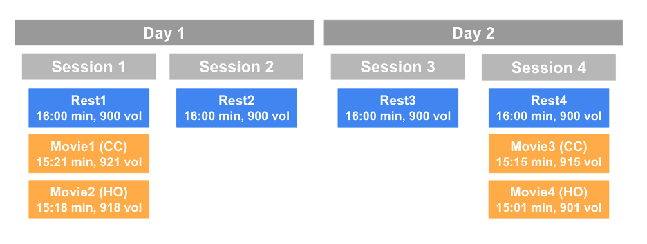
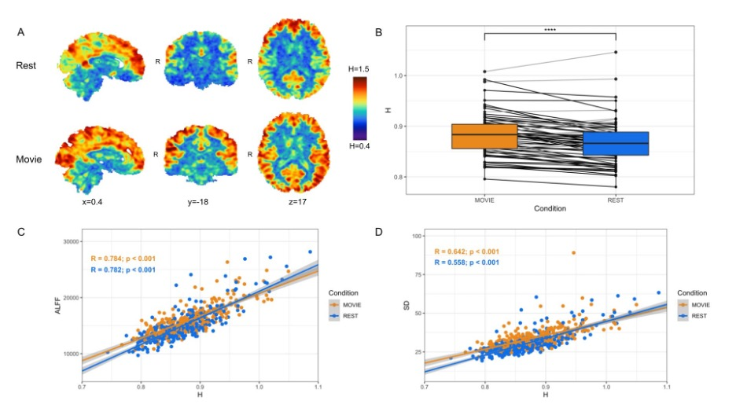
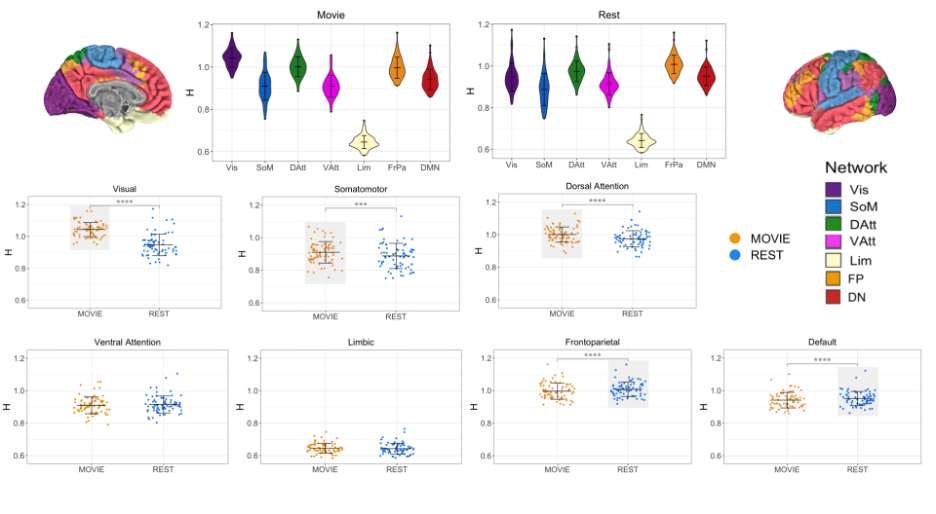
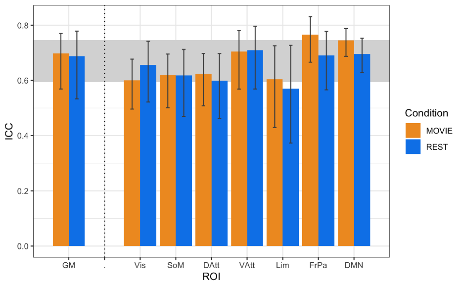
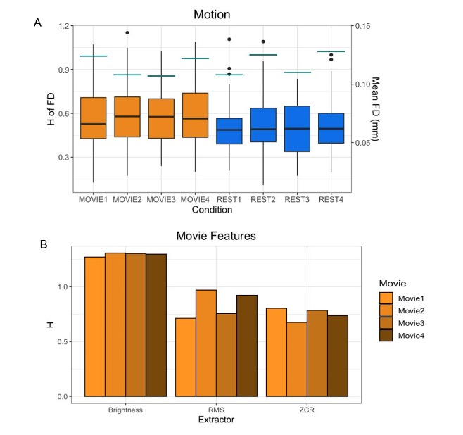

## Fractal-Based Analysis of fMRI BOLD Signal During Naturalistic Viewing Conditions 

**O. Campbell**, University of British Columbia; T. Vanderwal, University of British Columbia; **A. Weber**, University of British Columbia.

### UPDATE:

[This study has been published in _Frontiers Physiology_](https://www.frontiersin.org/articles/10.3389/fphys.2021.809943/full) since we submitted the abstract to ISMRM in Fall 2021. 

### Session Info:

Digital Poster\
Processing & Analysis: Data Processing I; Acquisition & Analysis; Module 22: Processing & Analysis\
Thursday, 12 May 2022 | 17:00 - 18:00\
Program Number: 2847\
Computer Number: 31

### Synopsis

We investigated the difference between the brain’s fractal dynamics during movie-watching and resting-state conditions using 7T fMRI data. During movie-watching, we find that the BOLD signal becomes more scale-invariant and self-similar than during the resting-state. This supports the idea that movie-watching evokes a state of optimal neural functioning that may better reflect the endogenous state of the brain than a fixed cross-hair. We also find that fractal properties differ greatly across functional networks, providing novel information about the temporal dynamics of each network during naturalistic processing. Overall, these findings advance understanding of both fractal dynamics and naturalistic viewing in fMRI.

### Introduction
Fractal processes are characterized by prominent scale-invariance and self-similarity across a hierarchy of time-scales1. Fractal analysis of functional magnetic resonance imaging (fMRI) data quantifies this scaling behaviour in a single parameter, the Hurst exponent (H). H is a measure of the strength of correlation in a signal, where higher values reflect a more correlated and temporally redundant structure in the blood-oxygen level dependent (BOLD) signal2. Multiple fMRI studies have observed that H is lower during conventional tasks relative to resting-state conditions, suggesting a shift to less correlated, more random signal processes during task completion3,4,5. However, to date no study has assessed BOLD signal fractal dynamics during more ecologically-valid and naturalistic tasks, such as movie-watching. Previous findings indicate that movie-watching alters the temporal characteristics of BOLD signal in unique ways6,7, but few papers have attempted to directly quantify these changes in signal characteristics. Therefore, we wanted to determine if the BOLD signal had different fractal dynamics during the processing of a continuous and naturalistic stimuli (movie) compared to a stationary cross-hair (rest). Furthermore, we aimed to investigate whether any differences were network specific, the test-retest reliability of H, and if BOLD signal fractal dynamics may originate from internal sources (i.e. motion) or external sources (i.e. movie features).

### Methods
The data are from the Human Connectome Project (HCPS1200 release)8. Resting-state and movie-watching fMRI data was collected on a 7T Siemen’s Magnetom scanner with TR=1s, TE=22.2 ms, flip angle=45°, FOV=208 x 208 mm2, voxel size=1.3x1.3x1.3 mm3. There are four runs per condition with a scan duration of ~15 minutes resulting in ~900 time-points each (Figure 1). The pre-processed ICA-FIX denoised data from HCP was used and a 5mm FWHM smoothing was applied. 72 subjects were included in the sample (41 F; 29.46 +/- 3.76 years of age) with a mean framewise displacement (FD) of >0.15mm. H was calculated using Welch’s method9 in the grey matter and 7 networks: visual (Vis), somatomotor (SoM), dorsal attention (DAtt), ventral attention (VAtt), limbic (Lim), frontoparietal (FP), and default network (DN)10. H was compared between conditions using a paired Student’s T-test and multiple comparisons were corrected for using Holm’s Step-Down Procedure. The intraclass correlation coefficient (ICC) was calculated for Movie and Rest using the ICC(2,1) model to measure reliability. H was also calculated for every subject’s FD time-series and the time-series of three movie features to analyze the fractal properties of head movement and the movie stimuli.

### Results
In contrast to previous work using conventional task paradigms, we found higher H values during movie-watching than rest in the grey matter (mean difference = 0.014; p = 5.279x10-7; 95% CI [0.009, 0.019]) (Figure 2). At the network level, H was significantly higher in the Vis, SoM and DAtt networks during movie-watching. Conversely, H was significantly lower during movie-watching in the FP and default networks (Figure 3). The ICC values indicate the test-retest reliability of H is good overall and there is no difference in movie-watching (0.698 (95% CI [0.569, 0.770]) and rest (0.688 (95% CI [0.533, 0.779]) conditions (Figure 4). We further found that H values of head motion estimates were non-fractal, whereas H values of movie-derived stimulus properties (e.g., luminance changes) were fractal (Figure 5).

### Figures

|  |
|:--:|
| **Fig 1:** A schematic of the HCP scanning protocol by day and session. Blue boxes indicate resting-state runs and orange boxes represent movie-watching runs. CC: Creative commons; HO: Hollywood excerpts. |

|  |
|:--:|
| **Fig 2:** Cross-condition comparison of whole-brain H (N=72). A) H values in rest (top) and movie-watching (bottom) of sample sagittal, coronal and axial slices in one subject. B) Box-plot of H between Movie Watching (orange) and Rest (blue) showing group-level finding that H-values are greater in Movie. C,D) Scatter-plot of H vs. ALFF and H vs. standard deviation of BOLD values, respectively, with Movie (orange) and Rest (blue), showing positive correlations for both conditions in both cases. |

|  |
|:--:|
| **Fig 3:** H across conditions, by network (N=72). Top centre: violin plots for Movie and Rest showing H values of seven RSNs from Yeo et al. Brains at the top left and right show topography of those networks using the same colours. Bottom: box-plot of H by condition for each RSN separately. Light grey boxes highlight which condition had the higher statistically significant average value. |

|  |
|:--:|
| **Fig 4:** ICCs of H across resting state runs and different movies. GM shown on left, with the seven RSNs on the right (separated by vertical dashed line). Vertical black bars represent 95% confidence intervals. Horizontal grey band in background represents good test-retest reliability (0.60<ICC<0.74). |

|  |
|:--:|
| **Fig 5:** H values of other possible sources of fractality. A) H values of the FD time-series of all 72 subjects by run are shown in the boxplots. Orange boxplots are the Movie runs, blue are the Rest runs. The mean FD values are shown by the horizontal teal lines for each run using the secondary y-axis (right). B) H values of the time-series of three movie features (brightness, RMS, ZCR) for each movie. |

### Discussion

In the grey matter, we found that H values were higher during movie-watching than the resting state. This means that during movie-watching there is stronger long-range dependence in the signal such that past dynamics more heavily mediate future brain processes. We speculate that as the brain configures and reconfigures to process the continually changing movie stimulus11, fractal dynamics are used to efficiently transition the brain through a rich sequence of brain states. This naturalistic task finding contrasts previous task-based reports of H, which found that it decreases from rest during a task3,4,5. We speculate this is because fractal dynamics involved in signal processing may depend largely on the nature of the stimulus, where continuous stimuli may evoke a more temporally redundant, hierarchical signal structure than a stationary crosshair. Furthermore, we find that changes in H differ greatly across networks; H is significantly higher during movie-watching in three networks and significantly lower in two. This suggests that individual networks exhibit distinct temporal dynamics that depend on the demands of the current task. From our investigation into fractal origins, we conclude that the fractal behaviour in the BOLD signal is unlikely due to intrinsic head motion. Moreover, we find that the movie features also have fractal properties, suggesting that the BOLD signal may be more fractal during movie-watching because the brain is processing a fractal stimulus. This supports the theory that movies evoke ecologically-valid dynamics since scale-invariant processes have more similar statistical properties to the real world11. Overall, our findings suggest that movie-watching induces signal dynamics that more closely resemble the brain’s endogenous fractal state.

### Conclusion

These findings provide new and quantitative information about BOLD signal characteristics during movie-watching conditions compared to the conventional resting-state. They reveal possible signal mechanisms involved in endogenous perception and lay a foundation for future investigations into the origin and function of scale-free dynamics in natural neural processing.

### Acknowledgements

We thank Jeffrey Eilbott for expert consultation with data management and analytics, and Michael Breakspear for helpful conceptual comments. The authors of this study were financially supported by the British Columbia Children’s Hospital Research Institute (Establishment Award and Salaries). There are no conflicts of interest to disclose. Data were provided by the Human Connectome Project, WU-Minn Consortium (Principal Investigators: David Van Essen and Kamil Ugurbil; 1U54MH091657) funded by the 16 NIH Institutes and Centers that support the NIH Blueprint for Neuroscience Research; and by the McDonnell Center for Systems Neuroscience at Washington University. Analysis code is available at https://github.com/WeberLab/FractalDimension/blob/master/welch.py.

### References

1. Eke, A., Hermán, P., Bassingthwaighte, J., Raymond, G., Percival, D., Cannon, M., Balla, I., Ikrényi, C., 2000. Physiological time series: distinguishing fractal noises from motions. Pflüg. Arch. 439, 403–415.
2. Eke, A., Herman, P., Kocsis, L., Kozak, L.R., 2002. Fractal characterization of complexity in temporal physiological signals. Physiol. Meas. 23, R1–R38.
3. Barnes, A., Bullmore, E.T., Suckling, J., 2009. Endogenous Human Brain Dynamics Recover Slowly Following Cognitive Effort. PLoS ONE 4
4. Churchill, N.W., Spring, R., Grady, C., Cimprich, B., Askren, M.K., Reuter-Lorenz, P.A., Jung, M.S., Peltier, S., Strother, S.C., Berman, M.G., 2016. The suppression of scale-free fMRI brain dynamics across three different sources of effort: aging, task novelty and task difficulty. Sci. Rep. 6.
5. He, B.J., 2011. Scale-Free Properties of the Functional Magnetic Resonance Imaging Signal during Rest and Task. J. Neurosci. 31, 13786–13795.
6. Betti, V., Della Penna, S., de Pasquale, F., Mantini, D., Marzetti, L., Romani, G.L., Corbetta, M., 2013. Natural Scenes Viewing Alters the Dynamics of Functional Connectivity in the Human Brain. Neuron 79, 782–797.
7. Vanderwal, T., Eilbott, J., Castellanos, F.X., 2019. Movies in the magnet: Naturalistic paradigms in developmental functional neuroimaging. Dev. Cogn. Neurosci. 36, 100600.
8. Van Essen, D.C., Ugurbil, K., Auerbach, E., Barch, D., Behrens, T.E.J., Bucholz, R., Chang, A., Chen, L., Corbetta, M., Curtiss, S.W., Della Penna, S., Feinberg, D., Glasser, M.F., Harel, N., Heath, A.C., Larson-Prior, L., Marcus, D., Michalareas, G., Moeller, S., Oostenveld, R., Petersen, S.E., Prior, F., Schlaggar, B.L., Smith, S.M., Snyder, A.Z., Xu, J., Yacoub, E., WU-Minn HCP Consortium, 2012. The Human Connectome Project: a data acquisition perspective. NeuroImage 62, 2222–2231.
9. Rubin, D., Fekete, T., Mujica-Parodi, L.R., 2013. Optimizing complexity measures for FMRI data: algorithm, artifact, and sensitivity. PloS One 8, e63448.
10. Thomas Yeo, B.T., Krienen, F.M., Sepulcre, J., Sabuncu, M.R., Lashkari, D., Hollinshead, M., Roffman, J.L., Smoller, J.W., Zöllei, L., Polimeni, J.R., Fischl, B., Liu, H., Buckner, R.L., 2011. The organization of the human cerebral cortex estimated by intrinsic functional connectivity. J. Neurophysiol. 106, 1125–1165.
11. Meer, J.N. van der, Breakspear, M., Chang, L.J., Sonkusare, S., Cocchi, L., 2020. Movie viewing elicits rich and reliable brain state dynamics. Nat. Commun. 11, 5004.12. Sonkusare, S., Breakspear, M., Guo, C., 2019. Naturalistic Stimuli in Neuroscience: Critically Acclaimed. Trends Cogn. Sci. 23, 699–714.

[Back to Conferences](/conferences/)