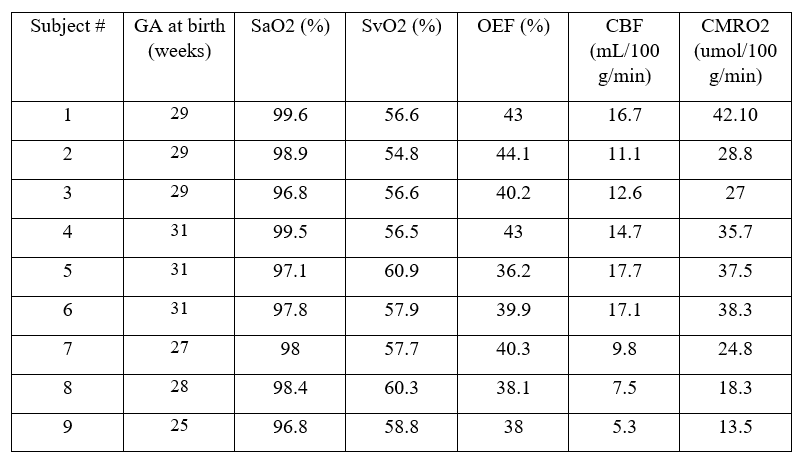
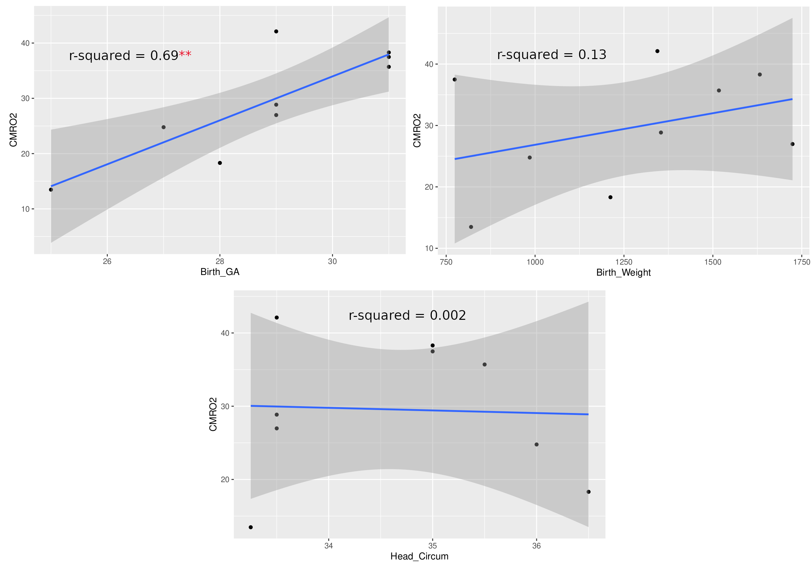
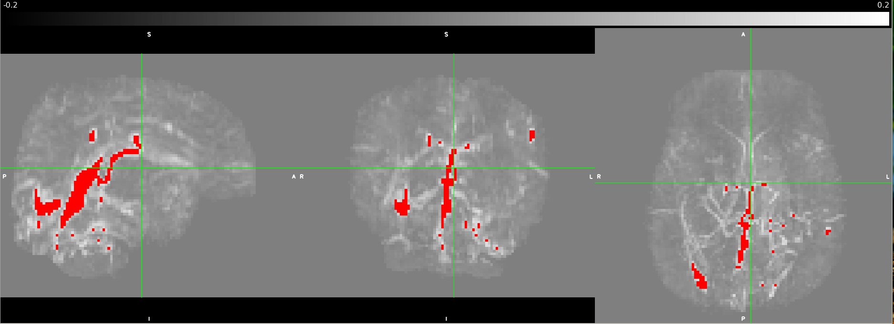
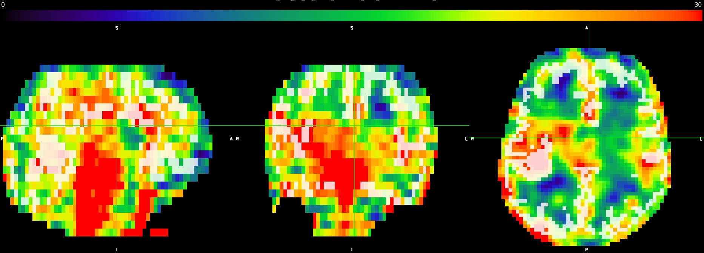

## Brain Health in Preterm Infants: Cerebral Metabolic Rate of Oxygen (CMRO2) Using Advanced MRI 

**C. S. Zhu**, BC Children’s Hospital; **A. Weber**, BC Children’s Hospital; R. Grunau, BC Children’s Hospital; N. Chan, BC Children’s Hospital

### CITATION:

Zhu CS, Weber AM, Grunau R, Chan N. Brain Health in Preterm Infants: Cerebral Metabolic Rate of Oxygen (CMRO2) Using Advanced MRI. Proc. Intl. Soc. Mag. Reson. Med. **30** (2022) 2368

### Session Info:

Digital Poster\
Susceptibility; Contrast Mechanisms; Module 16: Diffusion\
Wednesday, 11 May 2022 | 16:45 - 17:45\
Program Number: 2368\
Computer Number: 104

### Synopsis

Cerebral metabolic rate of oxygen (CMRO2) is a measurement of oxygen metabolism that may help determine outcomes in preterm neonates and improve treatments. However, limitations exist in current methods for measuring CMRO2. Advanced MRI techniques such as quantitative susceptibility mapping (QSM) may be able to overcome these challenges. GE 3T MRI data of preterm neonates at term equivalent age (TEA) (n=9) was obtained and analyzed using a standard equation to determine the CMRO2. CMRO2 values agreed with literature values and correlated strongly with birth age, but not with birth weight or head circumference at birth.

### Introduction

Approximately every 1 in 10 babies are born preterm1. About 50% display cognitive, motor, and behavioural problems long-term2. Improving the capacity to understand neonatal brain health is a major focus of neonatal medicine and can aid the development of optimized treatments. Oxygen metabolism in the brain is an important indicator of neonatal brain health; however, it has historically been difficult to measure in neonates. Most clinical measurements of oxygen metabolism only determine the level of oxygen delivery, for example, cerebral venous oxygen saturation (CSvO2), and not full oxygen metabolism such as cerebral metabolic rate of oxygen (CMRO2). Measurements of CMRO2 can provide information with greater clinical relevance including the balance of neonatal cerebral oxygen delivery and demand. Most studies measuring neonatal CMRO2 often use methods that have limitations or certain levels of invasiveness. Positron Emission Tomography (PET) is the gold standard for measuring CMRO2, however, there is concern that it may be unsafe in neonates due to the radiation used. Near infrared spectroscopy (NIRS) is alternative method which is safe but encounters limitations due to difficulties in determining the depth of light penetration3. Recent advances in magnetic resonance imaging (MRI) such as quantitative susceptibility mapping (QSM) in combination with arterial spin labeling (ASL) may be a safe, precise, and non-invasive method of quantifying CMRO2. It is hypothesized that CMRO2 values measured using advanced MRI techniques in preterm neonates at term equivalent age (TEA) will be between 20-45umol/100g/min and in agreement with literature values obtained from studies using PET4, NIRS5,6, or alternative MRI scans7-10. CMRO2 is also expected to be related to clinical indices health, such as birth age and head circumference. 

### Methods

To assess the feasibility of measuring CMRO2 in neonates using advanced MRI techniques, approximately 9 preterm neonates born <32 weeks gestation receiving standard clinical care in the NICU are being recruited at the Children's and Women's Health Centre of BC. 3D-T1w, 3DT2w, ASL and SWI/QSM sequences were obtained. MRI data was analyzed using a combination of FSL. ANTS, and in house Matlab and Python software and organized as per the Brain Imaging Data Structure (BIDS). T1w and T2w data was processed through the dHCP structural pipeline in order to obtain brain masks and grey matter segmentation. Cerebral blood flow (CBF) of grey matter is derived from ASL as shown in Equation (1)11:\

$$
CBF = 6000 \cdot \lambda
\frac{
(1-\exp(-\frac{ST(s)}{T_{1t}(s)})) \exp(\frac{PLD(s)}{T_{1b}(s)})
}{
2T_{1b}(s)\left(1-\exp(\frac{LT(s)}{T_{1b}(s)})\right)\epsilon \cdot NEX_{PW}
}
\left(\frac{PW}{SF_{pw}PD}\right)
$$

The QSM data is post-processed using an algorithm from [QSM.m](https://github.com/kamesy/QSM.m) to produce a magnetic susceptibility map.^12^ CSvO2 was derived from Equation (2).^13^

$$
SvO_{2} = 1 - \frac{\Delta\chi_{blood} - \Delta\chi_{oxy}\cdot Hct}{\Delta\chi_{do}\cdot Hct}
$$

Where $\chi_{blood}$ was taken to be the average of all $\chi$ above 0.15 ppm.^14^ The oxygen extraction fraction (OEF) was calculated from the arterial oxygen saturation (SaO2) derived from pulse oximeter measurements and the CSvO2. Using the OEF, the CBF, and the hemoglobin concentration, CMRO2 is calculated using Equation (3).^15^

$$
CMRO_{2} = OEF \cdot CBF \cdot [HbT] = (sO_{2,a} - sO_{2,v}) \cdot CBF \cdot [HbT]
$$

The relationship between CMRO2 and clinical measures of health will be evaluated through a partial correlation analysis using statistical software R.

### Results

Currently, CMRO2 values from 9 subjects have been obtained. Of the subjects, 6 were female. These values are illustrated in Table 1. Mean head circumference at birth was 34.64 cm; mean birth weight was 1262 g; the mean GA at birth was 28.89 weeks; and the mean age at scan was 39.4 weeks. CMRO2 values were also compared to GA at birth, birth weight, and head circumference at birth using a pearson correlation (Fig 1.) The correlation between GA at birth and CMRO2 was statistically significant (p = 0.0053, r2 = 0.69); whereas the other correlations we looked at were not (birth weight: p = 0.335, r2 = 0.133; head circumference: p = 0.908, r2 = 0.002)

### Figures

|  |
|:--:|
| **Table 1:** Table 1. Summary of PMA, SaO2, SvO2, OEF, CBF, and CMRO2 values for 9 subjects |

|  |
|:--:|
| **Fig 1:** Pearson correlation of CMRO2 with GA at birth, birth weight, and head circumference at birth |

|  |
|:--:|
| **Fig 2:** Processed QSM scan as underlay with a vessel mask projected in red at maximum intensity by thresholding the QSM image at 0.15ppm. The views from left to right are sagittal, coronal, and axial. |

|  |
|:--:|
| **Fig 3:** Processed ASL scan as underlay in color, from 0 to 30 mL/100 g/min, with a grey matter mask as overlay in slightly transparent white. The views from left to right are sagittal, coronal, and axial. |

### Discussion

These results represent a proof-of-concept of an ongoing pilot study of ours. We are just under halfway in terms of recruitment and data processing. We hope to use this pilot study to secure funding for a larger study, with follow-up. Literature standards of CMRO2 values in preterm neonates at TEA range from 20-45umol/100g/min. Values obtained from advanced MRI methods are within this range and thus agree with the literature. Two subjects had CMRO2 values lower than 20umol/100g/min; however, these subjects were also amongst the youngest, and we believe these values are accurate. As seen in Figure 1, CMRO2 correlated strongly with GA at birth (r2 = 0.69), but not birth weight or head circumference at birth. We hope to investigate the correlation of CMRO2 with other metrics in the future when we have access to more clinical data, such as time on respirator. The fact that CMRO2 correlates strongly with birth age suggests that babies born earlier have significantly lower cerebral oxygen metabolism values, even at equivalent term age. Finally, we are currently looking at whole-brain CMRO2. One benefit to CMRO2 obtained with MRI is a more region-based analysis of oxygen metabolism could be performed in the future to investigate regional brain health.

### Conclusion

This study provides preliminary proof-of-concept data to establish the feasibility of a non-invasive and precise advanced MRI technique in determining neonatal brain health and oxygen metabolism. This may be clinically relevant in further aiding and optimizing the development of therapies for brain injured neonates.

### Acknowledgements

We would like to thank the BC Children's Hospital Research Institute and the BC Children's Hospital BB&D Catalyst Grant for funding.

### References:

1. Purisch SE, Gyamfi-Bannerman C. Epidemiology of preterm birth. Seminars in Perinatology. 2017;41(7):387-391.
2. Spittle AJ, Barton S, Treyvaud K, Molloy CS, Doyle LW, Anderson PJ. School-age outcomes of early intervention for preterm infants and their parents: a randomized trial. PEDIATRICS. 2016;138(6):e20161363-e20161363.
3. Liu P, Chalak LF, Lu H. Non-invasive assessment of neonatal brain oxygen metabolism: A review of newly available techniques. Early Human Development. 2014;90(10):695-701.
4. Altman DI, Perlman JM, Volpe JJ, Powers WJ. Cerebral oxygen metabolism in newborns. Pediatrics. 1993;92(1):99-104.
5. Elwell CE, Henty JR, Leung TS, et al. Measurement of cmro2 in neonates undergoing intensive care using near infrared spectroscopy. In: Okunieff P, Williams J, Chen Y, eds. Oxygen Transport to Tissue XXVI. Advances in Experimental Medicine and Biology. Springer US; 2005:263-268.
6. Skov L, Pryds O, Greisen G, Lou H. Estimation of cerebral venous saturation in newborn infants by near infrared spectroscopy. Pediatr Res. 1993;33(1):52-55.
7. De Vis JB, Petersen ET, Alderliesten T, et al. Non-invasive MRI measurements of venous oxygenation, oxygen extraction fraction and oxygen consumption in neonates. NeuroImage. 2014;95:185-192.
8. Jain V, Buckley EM, Licht DJ, et al. Cerebral oxygen metabolism in neonates with congenital heart disease quantified by mri and optics. J Cereb Blood Flow Metab. 2014;34(3):380-388.
9. Liu P, Huang H, Rollins N, et al. Quantitative assessment of global cerebral metabolic rate of oxygen (CMRO 2 ) in neonates using MRI: NONINVASIVE MEASUREMENT OF CMRO 2 IN NEONATES BY MRI. NMR Biomed. 2014;27(3):332-340.
10. Shetty AN, Lucke AM, Liu P, et al. Cerebral oxygen metabolism during and after therapeutic hypothermia in neonatal hypoxic–ischemic encephalopathy: a feasibility study using magnetic resonance imaging. Pediatr Radiol. 2019;49(2):224-233.\
11. Massaro AN, Bouyssi-Kobar M, Chang T, Vezina LG, du Plessis AJ, Limperopoulos C. Brain perfusion in encephalopathic newborns after therapeutic hypothermia. AJNR Am J Neuroradiol. 2013;34(8):1649-1655.
12. Kames C, Wiggermann V, Rauscher A. Rapid two-step dipole inversion for susceptibility mapping with sparsity priors. NeuroImage. 2018;167:276-283.
13. Berg RC, Preibisch C, Thomas DL, Shmueli K, Biondetti E. Investigating the Effect of Flow Compensation and Quantitative Susceptibility Mapping Method on the Accuracy of Venous Susceptibility Measurement. Neuroscience; 2021.
14. Weber AM, Zhang Y, Kames C, Rauscher A. Quantitative susceptibility mapping of venous vessels in neonates with perinatal asphyxia. AJNR Am J Neuroradiol. 2021;42(7):1327-1333.
15. Chong SP, Merkle CW, Leahy C, Srinivasan VJ. Cerebral metabolic rate of oxygen (Cmro_2) assessed by combined Doppler and spectroscopic OCT. Biomed Opt Express. 2015;6(10):3941.

[Back to Conferences](/conferences/)