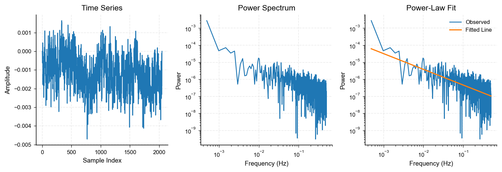
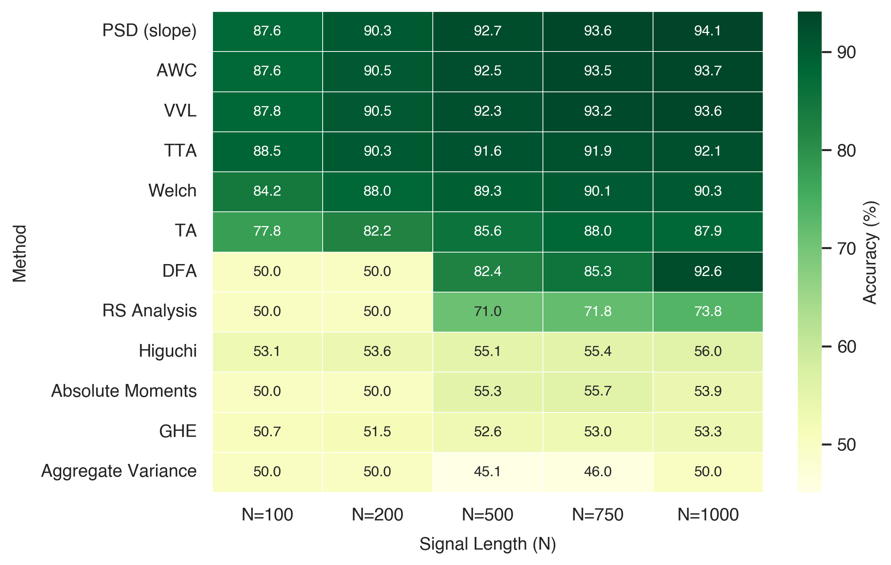
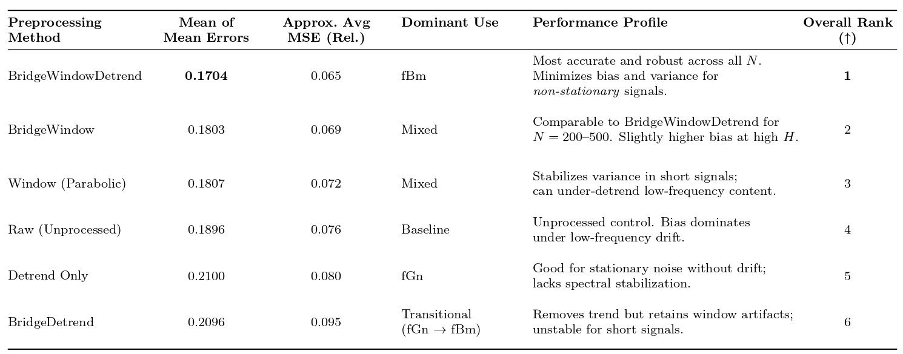
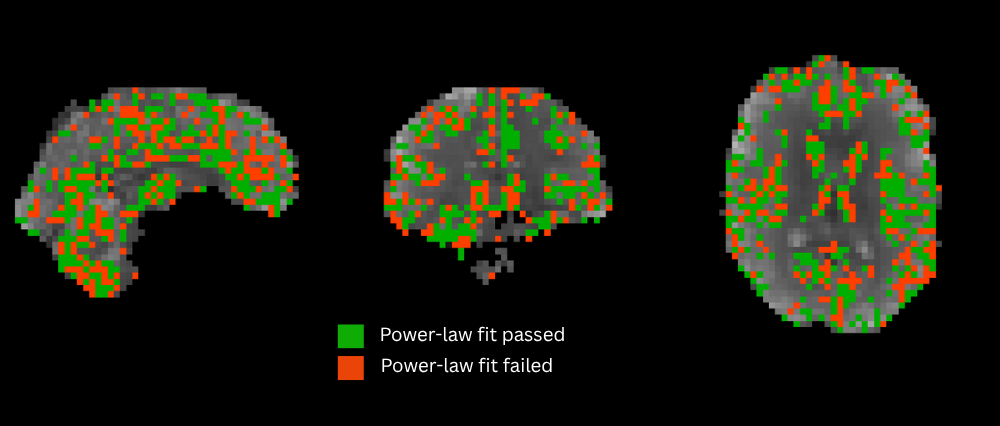

## A Rigorous Method for Measuring Power-Law Scaling Properties in fMRI Brain Signals

**Erhan Asad Javed**, University of British Columbia, Canada; **Alexander M Weber**, BC Children's Hospital Research Institute, Vancouver, BC, Canada; University of British Columbia, Canada

### Presentation Info

**Conference:** International Society for Magnetic Resonance in Medicine (ISMRM)  
**Presentation Type:** Traditional Poster  
**Session:** Brain Functional Methods  
**Date & Time:** Monday, 11 May at 9:15 AM  
**Primary Category:** Analysis Methods - Software Tools  
**Secondary Category:** Brain Function and fMRI - Functional Connectivity  
**Keywords:** FMRI ANALYSIS, RESTING-STATE FMRI, POWER-LAW SCALING, HURST EXPONENT, SCALE-FREE DYNAMICS  
**Presenting Author:** Erhan Asad Javed

### Impact

This work establishes a validated open-source framework for analyzing complex patterns in fMRI data. By improving the rigor of methods that analyze long-range temporal relationships in brain activity, it supports future research linking neural dynamics to cognition and pathology.

### Synopsis

Motivation: Power-law scaling in fMRI brain signals may reveal how the brain maintains critical balance between order and disorder, yet current estimation methods are inconsistent, sensitive to preprocessing, and not rigorous.

Goals: To develop and validate a Python tool for robust detection of power-law behavior and quantify long-range temporal correlations in both simulated and real fMRI data.

Approach: The framework integrates simulated benchmark signals, preprocessing, spectral slope analysis, automated frequency-window selection, and Monte Carlo validation.

Results: Our combined approach achieved >90% classification accuracy and stable Hurst exponent (H) estimates; voxelwise fMRI analysis revealed reproducible detection of region-specific temporal dynamics.

### Introduction

The 'Critical Brain Theory' suggests the brain evolved to operate in a critical state, balanced between order and disorder. Critical systems show scale-invariance and long-range temporal correlations . Accurately measuring these scale-free dynamics can deepen our understanding of brain function and health. However, the existing literature of fMRI Hurst exponent (H) estimation studies has been inconsistent, applying broad frequency filters (0.01 to 0.1 Hz), and has assumed a priori that all fMRI signals are power-law and stationary . The goal of this study was to develop and validate a rigorous signal-processing tool to (1) test whether a signal follows a power-law distribution and within what frequency range, (2) categorize it as either fractional Gaussian noise (fGn; stationary) or fractional Brownian motion (fBm; non-stationary), and (3) accurately estimate its Hurst exponent between 0 and 1.

### Methods

We implemented a comprehensive analysis framework in Python that integrates simulation, preprocessing, spectral estimation, and statistical validation (see Figure 1). Synthetic datasets of fGn and fBm were generated using the Davies–Harte , Spectral, and Hosking methods across signal lengths (N = 100–1000) and H values (0.01–0.99), following the situational framework of Eke et al (2000) . Multiple Hurst estimators were evaluated, including Detrended Fluctuation Analysis (DFA), Aggregated Whittle Coefficient (AWC), Time-Trend Analysis (TTA), Welch’s method, and Power Spectral Density (PSD)-based slope estimation .

Preprocessing techniques—Bridge detrending, windowing, and their combination (Bridge Window Detrend, BWD)—were systematically tested for their impact on estimation accuracy . Scaling exponents (β) were extracted via log–log linear regression of PSDs , and Monte Carlo testing against null simulations (n = 500–2500) was used to validate whether each signal’s PSD slope conformed to a true power-law . Classification between fGn and fBm was based on being greater or less than 1.

To improve stability in real data, an automated frequency-window selection routine was introduced to identify the optimal PSD range for fitting, prioritizing windows with high p-values, broad log-frequency spans, and strong correlations (|R|). The finalized pipeline was applied to voxelwise resting-state fMRI data after standard preprocessing and normalization.

### Results

Across all simulated datasets, PSD-based slope estimation consistently achieved the highest Hurst accuracy (mean error ≈ 0.17) and fGn/fBm classification performance (> 91%), outperforming DFA, AWC, and TTA methods (see Figure 2). The Bridge Window Detrend (BWD) preprocessing method yielded the lowest mean estimation error and the most stable fits, reducing spectral artifacts at both low and high frequencies (see Figure 3). Frequency-window optimization increased the proportion of signals that passed power-law validation from 85.8% to 90.2%, demonstrating improved robustness of scaling detection across varying signal lengths. Voxelwise maps of power-law fits are shown in Figure 4, illustrating spatial variation in temporal scaling and regions that pass the Monte Carlo power-law test.

When applied to fMRI data, preliminary voxelwise analyses indicate that a small subset of fMRI signals do not exhibit power-law scaling. Further work will assess what proportion of these signals reflect stationary (fGn-like) or non-stationary (fBm-like) regimes across cortical networks.

### Discussion

This framework offers a unified approach for testing power-law scaling in neural data by combining rigorous statistical validation, robust preprocessing, and efficient implementation. The use of Monte Carlo–based p-value testing mitigates false positives often associated with naive log–log fitting, while BWD preprocessing substantially improves spectral fidelity. Compared with previous methods (e.g., DFA or wavelet-based estimators), the proposed pipeline achieves higher accuracy, reproducibility, and adaptability to short, noisy fMRI signals. These improvements make it suitable for large-scale voxelwise analysis and inter-regional comparisons of temporal scaling.

### Conclusion

We present a validated, Python-based method for detecting power-law scaling and classifying neural signals by their underlying stochastic process. Combining PSD-based slope estimation, Bridge Window Detrend preprocessing, and frequency-window optimization yields robust Hurst estimation and reliable detection of scale-free behavior in both simulated and real fMRI data. Future work will extend this framework to study spatial correlations, brain-state transitions, and their links to neural criticality. To promote reproducibility, the tool will be made publicly available, enabling the field to adopt a standardized and rigorous approach to Hurst estimation in fMRI research.

### Figures

|  |
|:--:|
| **Figure 1:** Demonstration of the power-law analysis workflow for a simulated fractional Gaussian noise (fGn) time series. The left panel shows the synthetic time series, the middle shows its power spectrum on a log–log scale, and the right overlays the fitted power-law line used to estimate scaling behavior. This example omits frequency window selection for simplicity of explanation. |

|  |
|:--:|
| **Figure 2:** Performance of Hurst Estimation Methods for Classifying fBm and fGn Signals. Heatmap of classification accuracy (%) for 12 Hurst estimation methods on simulated fGn and fBm signals (N=100–1000). Spectral-slope estimators (PSD, AWC, VVL, TTA) reach >90% accuracy for N≥500, while others stay near chance. PSD-based estimation is the most robust and scalable. |

|  |
|:--:|
| **Figure 3:** Performance comparison of preprocessing methods for Hurst exponent estimation. Mean of mean errors, relative mean-squared error (MSE), and best-case frequencies are summarized across all simulation sizes (N = 100–1000). BridgeWindowDetrend achieved the lowest overall error and MSE, followed by BridgeWindow and Window. DetrendOnly was competitive for stationary fGn signals, while Raw and Bridge-only methods showed higher bias under low-frequency drift. |

|  |
|:--:|
| **Figure 4:** Power-Law Fit Map. Map derived from the same resting-state fMRI dataset showing voxels that passed Monte Carlo power-law validation (p ≥ 0.40). Green voxels indicate regions where BOLD signals exhibit scale-free dynamics. Slices at x = 2.7 mm, y = –17.1 mm, z = 17.8 mm after standard preprocessing. The map is restricted to voxels within a grey-matter mask. |

### Acknowledgements

This work was supported by a Natural Sciences and Engineering Research Council of Canada (NSERC) Discovery Grant and by the BC Children’s Hospital Foundation.

### References

1. He, B. J. (2011). Scale-free properties of the functional magnetic resonance imaging signal during rest and task. Journal of Neuroscience, 31(39), 13786-13795. https://doi.org/10.1523/JNEUROSCI.2111-11.2011  
2. Thurner, S., Windischberger, C., Moser, E., Walla, P., & Barth, M. (2003). Scaling laws and persistence in human brain activity. Physica A: Statistical Mechanics and its Applications, 326(3-4), 511-521. https://doi.org/10.1016/S0378-4371(03)00279-6  
3. Davies, R. B., & Harte, D. S. (1987). Tests for Hurst effect. Biometrika, 74(1), 95-101. https://doi.org/10.1093/biomet/74.1.95  
4. Hosking, J. R. (1984). Modeling persistence in hydrological time series using fractional differencing. Water resources research, 20(12), 1898-1908. https://doi.org/10.1029/WR020i012p01898  
5. Eke, A., Hermán, P., Bassingthwaighte, J., Raymond, G., Percival, D., Cannon, M., ... & Ikrényi, C. (2000). Physiological time series: distinguishing fractal noises from motions. Pflügers Archiv, 439(4), 403-415. https://doi.org/10.1007/s004249900135  
6. Zhang, H. Y., Feng, Z. Q., Feng, S. Y., & Zhou, Y. (2024). Typical Algorithms for Estimating Hurst Exponent of Time Sequence: A Data Analyst’s Perspective. IEEE Access. doi:10.1109/ACCESS.2024.3512542  
7. Clauset, A., Shalizi, C. R., & Newman, M. E. (2009). Power-law distributions in empirical data. SIAM review, 51(4), 661-703. https://doi.org/10.1137/070710111  
8. Marshall, N., Timme, N. M., Bennett, N., Ripp, M., Lautzenhiser, E., & Beggs, J. M. (2016). Analysis of power laws, shape collapses, and neural complexity: new techniques and MATLAB support via the NCC toolbox. Frontiers in physiology, 7, 250. https://doi.org/10.3389/fphys.2016.00250  

[Back to Conferences](/conferences/)