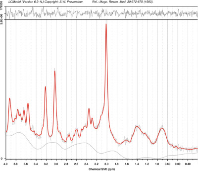

If this page hasn't been updated in a while, you can find an up-to-date publication list on [Dr. Weber's Google Scholar page](https://scholar.google.com/citations?hl=en&user=nPuyG8gAAAAJ&view_op=list_works&sortby=pubdate)  
\*Authors contributed equally; members of the Weber lab indicated in **boldface**

## 2025

### [The Application of Magnetic Susceptibility Separation for Measuring Cerebral Oxygenation in Preterm Neonates](https://weberlab.github.io/Chisep_CSVO2_Manuscript/)

**Carmichael GT**, Rauscher A, Grunau RE, **Weber AM**. _Pediatric Research 97_. 2025.

{: width="600" }

## 2024

### [Long-range temporal correlation development in resting-state fMRI signal in preterm infants: scanned shortly after birth and at term-equivalent age](https://journals.plos.org/complexsystems/article?id=10.1371/journal.pcsy.0000024)

**Drayne JP**, **Mella AE**, McLean MM, Ufkes S, Chau V, Guo T, Branson HM, Kelly E, Miller SP, Grunau RE, **Weber AM**. _PLOS Complex Systems 1(4)_. Dec 5, 2024 [10.1371/journal.pcsy.0000024](https://doi.org/10.1371/journal.pcsy.0000024)

{: width="600" }

<!--  -->

### [Temporal complexity of the BOLD-signal in preterm versus term infants](https://academic.oup.com/cercor/article/34/10/bhae426/7906856)

**Mella AE**, Vanderwal T, Miller SP, **Weber AM**. _Cerebral Cortex 34(10)_, Oct 2024 [10.1093/cercor/bhae426](https://doi.org/10.1093/cercor/bhae426)

### [Iron Deficiency and Sleep/Wake Behaviors: A Scoping Review of Clinical Practice Guidelines—How to Overcome the Current Conundrum?](https://www.mdpi.com/2072-6643/16/15/2559)

McWilliams S, Hill O, Ipsiroglu OS, Clemens S, **Weber AM**, Chen M, Connor J, Felt BT, Manconi M, Mattman A, Silvestri R, Simakajornboon N, Smith SM, Stockler S. _Nutrients 16(15)_. August 3, 2024. [10.3390/nu16152559](https://doi.org/10.3390/nu16152559)

{: width="500" }

### [Cerebrovascular Reactivity Following Spinal Cord Injury](https://meridian.allenpress.com/tscir/article/30/2/78/500875)

**Weber AM**, Nightingale TE, Jarrett M, Lee AHX, **Campbell OL**, Walter M, Lucas SJE, Phillips A, Rauscher A, Krassioukov AV. _Topics in Spinal Cord Injury Rehabilitation 30 (2), 78-95_. May 23, 2024. [doi: 10.46292/sci23-00068](https://doi.org/10.46292/sci23-00068)

### [Changes in cortical grey matter volume with Cognitive Orientation to daily Occupational Performance intervention in children with developmental coordination disorder](https://www.ncbi.nlm.nih.gov/pmc/articles/PMC11150831/)

Malik MA, **Weber AM**, Lang D, Vanderwal T, Zwicker JG. _Frontiers in Human Neuroscience 18, 1276057_. May 22, 2024. [doi: 10.3389/fnhum.2024.1316117](10.3389/fnhum.2024.1316117)

### [Cortical grey matter volume differences in children with developmental coordination disorder compared to typically developing children](https://www.frontiersin.org/articles/10.3389/fnhum.2024.1276057/full)

Malik MA, **Weber AM**, Lang D, Vanderwal T, Zwicker JG. _Frontiers in Human Neuroscience 18_. May 17, 2024. [doi: 10.3389/fnhum.2024.1276057](https://doi.org/10.3389/fnhum.2024.1276057)

<!--  -->

{: width="500" }

## 2023

### [The Effects of Wearing a 3‐Ply or KN95 Face Mask on Cerebral Blood Flow and Oxygenation](https://onlinelibrary.wiley.com/doi/full/10.1002/jmri.28448)

Fotherbill A, Birkl C, Kames C, Su W, **Weber AM**, Rauscher A. _JMRI_. September 30, 2022. [10.1002/jmri.28448](https://doi.org/10.1002/jmri.28448)

## 2022

### [Orientation Dependence of R2 Relaxation in the Newborn Brain](https://www.sciencedirect.com/science/article/pii/S1053811922008230)

Bartels LM, Doucette J, Birkl C, Zhang Y, **Weber AM**, Rauscher A. _NeuroImage_. December 1, 2022. [10.1016/j.neuroimage.2022.119702](https://doi.org/10.1016/j.neuroimage.2022.119702)

### [Monofractal Analysis of Functional Magnetic Resonance Imaging: An Introductory Review](https://onlinelibrary.wiley.com/doi/full/10.1002/hbm.25801)

**Campbell OL**, **Weber AM**. _Human Brain Mapping_. June 1, 2022. [doi: 10.1002/hbm.25801](https://doi.org/10.1002/hbm.25801)

{: width="500" }

<!--  -->

### [Fractal-Based Analysis of fMRI BOLD Signal During Naturalistic Viewing Conditions](https://doi.org/10.3389/fphys.2021.809943)

**Campbell OL**, Vanderwal T\*, **Weber AM**\*. _Frontiers in Physiology_. January 11, 2022. [doi: 10.3389/fphys.2021.809943](https://doi.org/10.3389/fphys.2021.809943)

## 2021

### [Quantitative Susceptibility Mapping of Venous Vessels in Neonates With Perinatal Asphyxia](http://www.ajnr.org/content/early/2021/04/01/ajnr.A7086)

**Weber AM**, Zhang Y, Kames C, Rauscher A. _American Journal of Neuroradiology_. April 2021. [doi: 10.3174/ajnr.A7086](https://doi.org/10.3174/ajnr.A7086)

## 2020

### [Myelin Water Imaging and R2* Mapping in Neonates: Investigating R2* Dependence on Myelin and Fibre Orientation in Whole Brain White Matter](https://analyticalsciencejournals.onlinelibrary.wiley.com/doi/10.1002/nbm.4222)

**Weber AM**, Zhang Y, Kames C, Rauscher A. _NMR in Biomedicine_, e4222. March 2020. [doi: 10.1002/nbm.4222](https://doi.org/10.1002/nbm.4222)

## 2019

### [Quantitative Analysis of Punctate White Matter Lesions in Neonates Using Quantitative Susceptibility Mapping and R2\* Relaxation](http://www.ajnr.org/content/early/2019/06/20/ajnr.A6114)

Zhang Y, Kames C, Rauscher A, **Weber AM**. _American Journal of Neuroradiology_. Jul 2019. [doi: 10.3174/ajnr.A6114](https://doi.org/10.3174/ajnr.A6114)

{: width="500" }

<!--  -->

## 2018

### [Pathological Insights From Quantitative Susceptibility Mapping and Diffusion Tensor Imaging in Ice Hockey Players Pre and Post-concussion](https://www.ncbi.nlm.nih.gov/pmc/articles/PMC6091605/)

**Weber AM**, Pukropski A, Kames C, Jarrett M, Dadachanji S, Taunton J, Li DKB, Rauscher A. _Front Neurol_, **9**:575. Aug 2018. [doi: 10.3389/fneur.2018.00575](https://doi.org/10.3389/fneur.2018.00575)

 

---

### Two year post PhD sabbatical in Whitehorse, YT working with youth

---

 

## 2014

### [A Preliminary Study on the Effects of Acute Ethanol Ingestion on Default Mode Network and Temporal Fractal Properties of the Brain](https://link.springer.com/article/10.1007/s10334-013-0420-5)

**Weber AM**, Soreni N, Noseworthy MD. _MAGMA_, **27**(4):291-301. Aug 2014. [doi: 10.1007/s10334-013-0420-5](https://doi.org/10.1007/s10334-013-0420-5)

 

### [A Preliminary Study of Functional Connectivity of Medication Naïve Children with Obsessive-Compulsive Disorder](https://www.sciencedirect.com/science/article/abs/pii/S0278584614000773?via%3Dihub)

**Weber AM**, Soreni N, Noseworthy MD. _Progress in Neuropsychopharmacology & Biological Psychiatry_, **53C**:129-136. Apr 2014. [doi: 10.1016/j.pnpbp.2014.04.001](https://doi.org/10.1016/j.pnpbp.2014.04.001)

 

### [Proton Magnetic Resonance Spectroscopy of Prefrontal White Matter in Psychotropic Naïve Children and Adolescents with Obsessive-Compulsive Disorder](https://www.sciencedirect.com/science/article/abs/pii/S0925492714000316?via%3Dihub)

**Weber AM**, Soreni N, Stanley JA, Greco A, Mendlowitz S, Szatmari P, Schachar R, Mannasis K, Pires P, Noseworthy MD. _Psychiatry Research_. **222**(1-2):67-74. Apr 2014. [doi: 10.1016/j.pscychresns.2014.02.004](https://doi.org/10.1016/j.pscychresns.2014.02.004)

## 2013

### [Metabolite Measurements in the Caudate Nucleus, Anterior Cingulate Cortex and Hippocampus Among Patients with Mitochondrial Disorders: a Case-Control Study Using Proton Magnetic Resonance Spectroscopy](http://cmajopen.ca/content/1/1/E48)

Anglin RE, Rosebush PI, Noseworthy MD, Tarnopolsky M, **Weber AM**, Soreni N, Mazurek MF. _Canadian Medical Association Journal Open_, **1**(1):E48-55. Apr 2013. [doi: 10.9778/cmajo.20120020](https://doi.org/10.9778/cmajo.20120020)

{: width="500" }

<!--  -->

## 2010

### [N-type Ca2+ Channels Carry the Largest Current: Implications for Nanodomains and Transmitter Release](https://www.nature.com/articles/nn.2657)

**Weber AM**, Wong FK, Tufford AR, Schlichter LC, Matveev V, Stanley EF. _Nature Neuroscience_, **13**(11):1348-50. Oct 2010. [doi: 10.1038/nn.2657](https://doi.org/10.1038/nn.2657)

## 2009

### [PDLIM5 is Not a Neuronal CaV2.2 Adaptor Protein](https://www.nature.com/articles/nn0809-957a)

Gardezi SR, **Weber AM**, Li Q, Wong FK, Stanley EF. _Nature Neuroscience_, **12**(8):957-8. Aug 2009. [doi: 10.1038/nn0809-957a](https://doi.org/10.1038/nn0809-957a)

